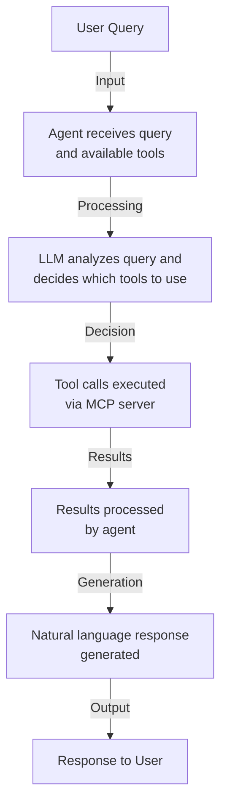

# MCP Weather Client Agent - Challenge 03 Solution (Python)

This is the Python solution for Challenge 03 of the Developing Agentic AI Apps Hackathon. This project implements an agent-based MCP client using the Microsoft Agent Framework that can connect to MCP servers and provide intelligent natural language interactions.

## Features

The MCP client agent provides:

1. **Intelligent Tool Discovery**: Automatically discovers available tools from connected MCP servers
2. **Natural Language Processing**: Uses an LLM (Azure OpenAI) to understand user queries and decide which tools to use
3. **Async/Await Architecture**: Non-blocking I/O for efficient handling of multiple requests
4. **Interactive Chat Interface**: User-friendly command-line interface for asking weather questions
5. **Structured Tool Integration**: Clean integration between agent reasoning and MCP tool execution

## Project Structure

```
mcp_weather_client/
├── mcp_weather_client.py     # Main agent client implementation
├── requirements.txt          # Python dependencies
├── .env                      # Environment variables (not in repo)
└── .venv/                    # Virtual environment (created during setup)
```

## Dependencies

- **agent-framework**: Microsoft Agent Framework for building AI agents
- **mcp[cli]**: Model Context Protocol SDK with CLI tools
- **python-dotenv**: Environment variable management for API keys

## Setup and Running

### 1. Create Virtual Environment and Install Dependencies

**For faster dependency management, consider using `uv`:** [`uv` is an extremely fast Python package installer and resolver](https://docs.astral.sh/uv/). It's significantly faster than `pip` (10-100x in many cases) and handles dependency resolution more efficiently. You can install it from https://docs.astral.sh/uv/getting-started/installation/.

**Using `uv` (recommended for performance):**
```bash
# Create project directory
mkdir mcp_weather_client
cd mcp_weather_client

# Create virtual environment
uv venv .venv

# Activate virtual environment
source .venv/bin/activate  # On Windows: .venv\Scripts\activate

# Install dependencies
uv pip install -r requirements.txt
```

**Or using standard `pip`:**
```bash
# Create project directory
mkdir mcp_weather_client
cd mcp_weather_client

# Create virtual environment
python -m venv .venv

# Activate virtual environment
source .venv/bin/activate  # On Windows: .venv\Scripts\activate

# Install dependencies
pip install -r requirements.txt
```

### 2. Configure Your Azure OpenAI Credentials

Create a `.env` file in your project directory:

```env
AZURE_OPENAI_ENDPOINT=https://your-resource.openai.azure.com/
AZURE_OPENAI_API_KEY=your_azure_openai_api_key_here
AZURE_OPENAI_DEPLOYMENT_NAME=your_deployment_name
AZURE_OPENAI_API_VERSION=latest
```

`AZURE_OPENAI_API_VERSION` now accepts "latest" as a value. This feature is undocumented.
The recommended way forward is to switch to the new v1 API (/openai/v1/), which no longer
requires passing an API version parameter.

> ⚠️ **Never commit your .env file to version control!** Add it to `.gitignore`.

### 3. Run the Client Agent

Start the client agent. The first and only argument to the command
should be the path to the MCP server from Challenge-02.

```bash
python mcp_weather_client.py ../../Challenge-02/python/weather.py
```

Expected output:
```
[10/24/25 16:34:00] INFO     Processing request of type ListToolsRequest                                                                                           server.py:674
                    INFO     Processing request of type ListPromptsRequest                                                                                         server.py:674

============================================================
Weather Assistant
============================================================
Ask me about the weather. Type 'exit' to quit.

You: Is it going to rain tomorrow in Seattle?
Agent: [10/24/25 15:58:05] INFO     Processing request of type CallToolRequest                                                                                            server.py:674
[10/24/25 15:58:08] INFO     HTTP Request: GET https://api.weather.gov/points/47.6062,-122.3321 "HTTP/1.1 200 OK"                                                _client.py:1740
[10/24/25 15:58:09] INFO     HTTP Request: GET https://api.weather.gov/gridpoints/SEW/125,68/forecast "HTTP/1.1 200 OK"                                          _client.py:1740
Yes, it's going to rain in Seattle tomorrow.

- **Friday Forecast**:
  - High Temperature: 61°F
  - Winds: 9 to 13 mph SSW
  - Forecast: Rain expected, with a 100% chance of precipitation. New rainfall amounts between a quarter and half of an inch possible.

```

The agent will:
1. Connect to the weather server
2. Discover available tools
3. Initialize the OpenAI-backed agent
4. Start an interactive chat session

Try asking questions like:
- "What's the weather in Sacramento?"
- "Are there any weather alerts for California?"
- "Give me the forecast for Seattle"
- "Tell me about weather alerts in Texas"

## Architecture

### Client Agent Flow



### Key Components

1. **Main Function**
   - Validates command-line arguments for server path
   - Loads Azure OpenAI configuration from environment
   - Creates Azure OpenAI chat client
   - Initializes MCPStdioTool for the weather server
   - Sets up and runs the interactive agent

2. **MCPStdioTool Integration**
   - Creates a tool that wraps the MCP server using stdio transport
   - Automatically discovers and manages tools from the MCP server
   - Seamlessly integrates MCP tools with the Agent Framework

3. **ChatAgent Integration**
   - Uses Microsoft Agent Framework ChatAgent for agent orchestration
   - Integrates with Azure OpenAI for language understanding
   - Processes user queries and generates responses
   - Automatically manages tool selection and execution

## Implementation Notes

### Design Patterns

**MCPStdioTool Pattern**: Simplifies MCP integration by wrapping the MCP server:
```python
mcp_tool = MCPStdioTool(
    name="WeatherMCP",
    command="python",
    args=[server_path]
)
```

**Agent Context Management**: Uses async context manager for proper resource cleanup:
```python
async with ChatAgent(
    chat_client=chat_client,
    name="WeatherAgent",
    instructions="You are a helpful weather assistant.",
    tools=[mcp_tool]
) as agent:
    # Agent operations here
```

**Interactive Loop Pattern**: Simple request-response loop for user interaction:
```python
while True:
    user_input = input("You: ").strip()
    response = await agent.run(user_input)
    print(response)
```

### Agent Framework Integration

The agent is initialized with:
- Azure OpenAI chat client for language processing
- Instructions that define the agent's behavior
- MCPStdioTool providing access to MCP server tools

```python
chat_client = AzureOpenAIResponsesClient(
    endpoint=endpoint,
    api_key=api_key,
    deployment_name=deployment_name,
    api_version=api_version
)

agent = ChatAgent(
    chat_client=chat_client,
    name="WeatherAgent",
    instructions="You are a helpful weather assistant...",
    tools=[mcp_tool]
)
```

### Error Handling

The client includes:
- Environment variable validation with clear error messages
- Server file existence checking
- File argument validation
- Interactive error recovery with try-except blocks
- Graceful handling of interrupt signals (Ctrl+C)

## Extending the Client

### Using Different LLM Providers

Switch between providers by using different chat clients:

```python
# Azure OpenAI (current implementation)
from agent_framework.azure import AzureOpenAIResponsesClient

# OpenAI
from agent_framework.openai import OpenAIResponsesClient

# Anthropic
from agent_framework.anthropic import AnthropicChatClient
```

### Customizing Agent Instructions

Modify the system prompt to change agent behavior:

```python
instructions = "You are an expert weather analyst. Answer weather questions accurately using the available tools."
```

### Connecting to Multiple MCP Servers

Create multiple MCPStdioTool instances and pass them to the agent:

```python
weather_tool = MCPStdioTool(
    name="WeatherMCP",
    command="python",
    args=[weather_server_path]
)

news_tool = MCPStdioTool(
    name="NewsMCP",
    command="python",
    args=[news_server_path]
)

async with ChatAgent(
    chat_client=chat_client,
    name="MultiToolAgent",
    instructions="You have access to weather and news tools...",
    tools=[weather_tool, news_tool]
) as agent:
    # Use both tools
```

## Troubleshooting

**Missing Command-Line Arguments**
- Run with: `python mcp_weather_client.py <path_to_weather_server.py>`
- Example: `python mcp_weather_client.py ../../Challenge-02/python/weather.py`

**Server File Not Found**
- Verify the path to the weather server is correct and relative to your current directory
- Use absolute paths if you encounter issues with relative paths

**Missing Environment Variables**
- Verify all required Azure OpenAI settings are in `.env` file:
  - `AZURE_OPENAI_ENDPOINT`
  - `AZURE_OPENAI_API_KEY`
  - `AZURE_OPENAI_DEPLOYMENT_NAME`
  - `AZURE_OPENAI_API_VERSION`
- Check that `.env` file is in the current working directory. For convenience, an `.env.sample` file is provided.

**Connection Issues**
- Check that Python 3.10+ is being used
- Check path to server script (weather.py)

**Import Errors**
- Reinstall dependencies: `pip install -r requirements.txt`
- Verify virtual environment is activated: `source .venv/bin/activate`
- Check that agent-framework is installed: `pip list | grep agent-framework`

**Agent Not Responding**
- Verify Azure OpenAI API key is valid and has available quota
- Check network connectivity to Azure OpenAI endpoint
- Review error messages in console output

## Success Criteria Met

- ✅ Python agent application using Microsoft Agent Framework
- ✅ Connects to MCP servers over stdio transport
- ✅ Discovers and lists tools from connected servers
- ✅ Interactive command-line interface for user queries
- ✅ Integration with Azure OpenAI for natural language understanding
- ✅ Agent can reason about which tools to use based on queries
- ✅ Agent can execute tool calls on MCP servers
- ✅ User can ask weather questions and get responses
- ✅ Works seamlessly with Weather MCP Server from Challenge 02

## Learning Resources

- [Microsoft Agent Framework Documentation](https://learn.microsoft.com/en-us/agent-framework/)
- [Agent Framework Python Samples](https://github.com/microsoft/agent-framework/tree/main/python/samples)
- [Model Context Protocol Overview](https://modelcontextprotocol.io/)
- [MCP Python SDK Documentation](https://modelcontextprotocol.io/docs/sdk/python)
- [Azure OpenAI API Documentation](https://learn.microsoft.com/en-us/azure/ai-services/openai)
- [AsyncIO Documentation](https://docs.python.org/3/library/asyncio.html)
- [Agent Framework Chat Agent](https://learn.microsoft.com/en-us/agent-framework/concepts/agents)
