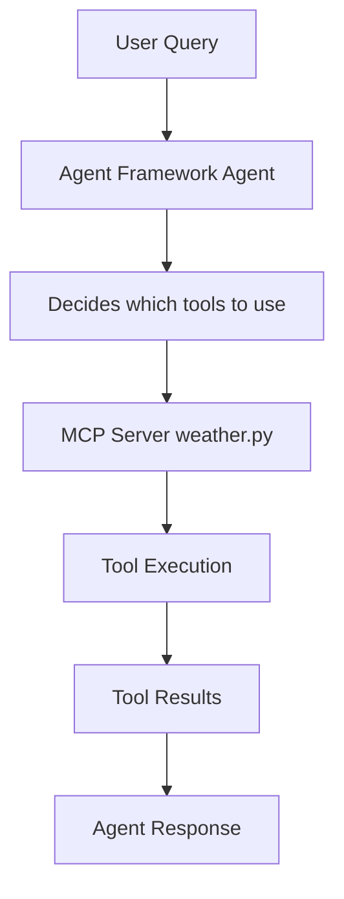

# Agent with MCP Integration - Challenge 06 Solution (Python)

This project demonstrates full integration between the Microsoft Agent Framework and MCP servers.

## Features

- **Seamless Agent-MCP Integration**: Agents can use MCP tools as native capabilities
- **Multi-Tool Support**: Access tools from multiple MCP servers
- **Type-Safe Tool Calling**: Proper parameter validation and tool discovery
- **Error Handling**: Graceful handling of tool call failures
- **Streaming Support**: Real-time agent responses

## Architecture



## Setup

**For faster dependency management, consider using `uv`:** [`uv` is an extremely fast Python package installer and resolver](https://docs.astral.sh/uv/). It's significantly faster than `pip` (10-100x in many cases) and handles dependency resolution more efficiently. You can install it from https://docs.astral.sh/uv/getting-started/installation/.

**Using `uv` (recommended for performance):**
```bash
uv venv .venv
source .venv/bin/activate
uv pip install -r requirements.txt
```

**Or using standard `pip`:**
```bash
python -m venv .venv
source .venv/bin/activate
pip install -r requirements.txt
```

## Usage

```bash
python agent_with_mcp.py ../weather_mcp_server/weather.py
```

## Success Criteria Met

✅ Agent Framework integrates with MCP servers
✅ Tools from MCP servers are accessible to agent
✅ Agent can reason about tool usage
✅ Tool execution works correctly
✅ Multi-turn conversations supported

## Learning Resources

- [Agent Framework Documentation](https://learn.microsoft.com/en-us/agent-framework/)
- [MCP Protocol Specification](https://modelcontextprotocol.io/)
- [Tool Integration Guide](https://learn.microsoft.com/en-us/agent-framework/concepts/tools)
