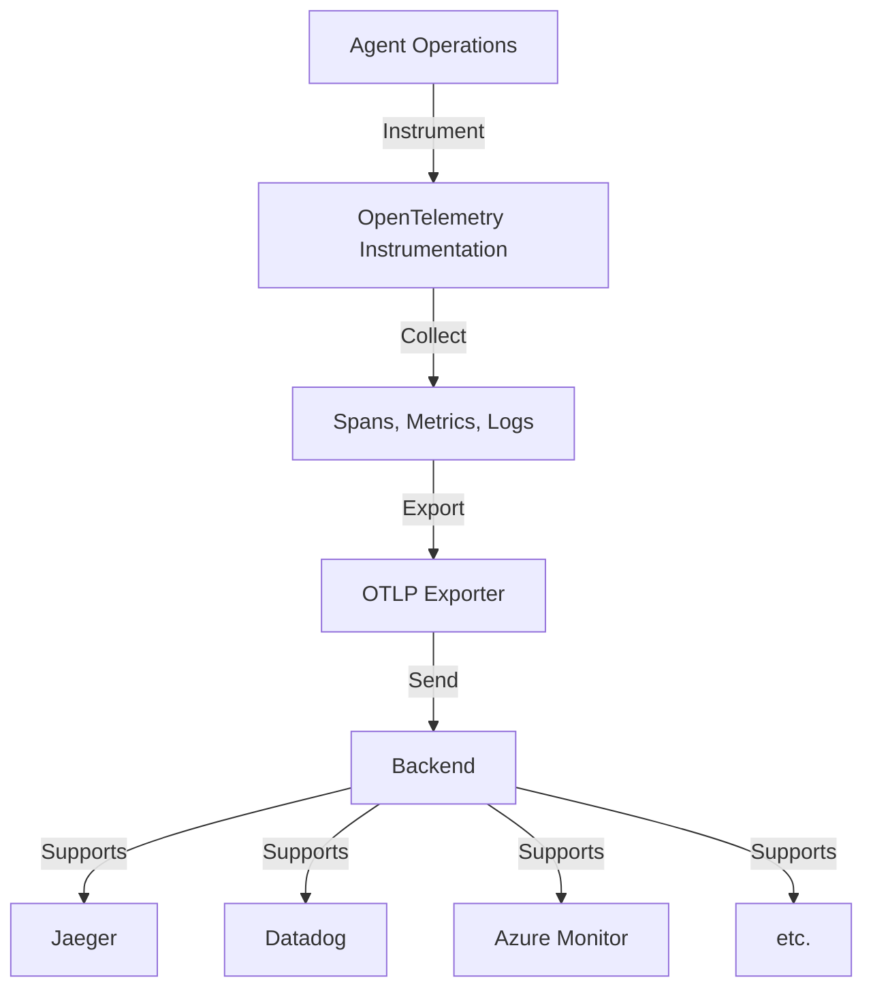

# Observable Agent with Tracing - Challenge 07 Solution (Python)

This project demonstrates comprehensive observability for Agent Framework applications using OpenTelemetry.

## Features

- **Distributed Tracing**: Track agent operations end-to-end
- **Custom Metrics**: Monitor agent performance and usage
- **Structured Logging**: Contextual logging with trace correlation
- **OpenTelemetry Integration**: Industry-standard observability
- **Multiple Exporters**: Support for Jaeger, Datadog, Azure Monitor, etc.
- **Automatic Instrumentation**: Built-in instrumentations for common libraries

## Architecture



## Setup

### Prerequisites
- OpenTelemetry Collector (or service like Jaeger)
- Python 3.10+

### Installation

**For faster dependency management, consider using `uv`:** [`uv` is an extremely fast Python package installer and resolver](https://docs.astral.sh/uv/). It's significantly faster than `pip` (10-100x in many cases) and handles dependency resolution more efficiently. You can install it from https://docs.astral.sh/uv/getting-started/installation/.

**Using `uv` (recommended for performance):**
```bash
uv venv .venv
source .venv/bin/activate
uv pip install -r requirements.txt
```

**Or using standard `pip`:**
```bash
python -m venv .venv
source .venv/bin/activate
pip install -r requirements.txt
```

### Configuration

Create a `.env` file:
```env
OTEL_EXPORTER_OTLP_ENDPOINT=localhost:4317
OTEL_SERVICE_NAME=observable-agent
OTEL_TRACES_EXPORTER=otlp
OTEL_METRICS_EXPORTER=otlp
```

### Running with Jaeger (Local Development)

1. Start Jaeger:
```bash
docker run -d --name jaeger \
  -e COLLECTOR_OTLP_ENABLED=true \
  -p 4317:4317 \
  -p 16686:16686 \
  jaegertracing/all-in-one:latest
```

2. Run the agent:
```bash
python observable_agent.py ../weather_mcp_server/weather.py
```

3. View traces at: http://localhost:16686

## Observability Features

### Tracing
- Session lifecycle tracking
- Query processing traces
- Error tracking and attribution
- Latency measurements

### Metrics
- Query count
- Processing time
- Error rate
- Tool usage frequency

### Logging
- Structured logs with trace context
- Event logging
- Error reporting
- Performance metrics

## Usage Example

```bash
python observable_agent.py ../weather_mcp_server/weather.py
```

All interactions will be traced and exported to your configured backend.

## Success Criteria Met

✅ OpenTelemetry integration for comprehensive tracing
✅ Structured logging with trace correlation
✅ Custom metrics for agent performance
✅ Support for multiple export backends
✅ Automatic instrumentation of dependencies
✅ Complete visibility into agent operations

## Learning Resources

- [OpenTelemetry Python](https://opentelemetry.io/docs/instrumentation/python/)
- [OpenTelemetry Best Practices](https://opentelemetry.io/docs/concepts/observability-primer/)
- [Jaeger Documentation](https://www.jaegertracing.io/docs/)
- [Agent Framework Observability](https://learn.microsoft.com/en-us/agent-framework/concepts/observability)
