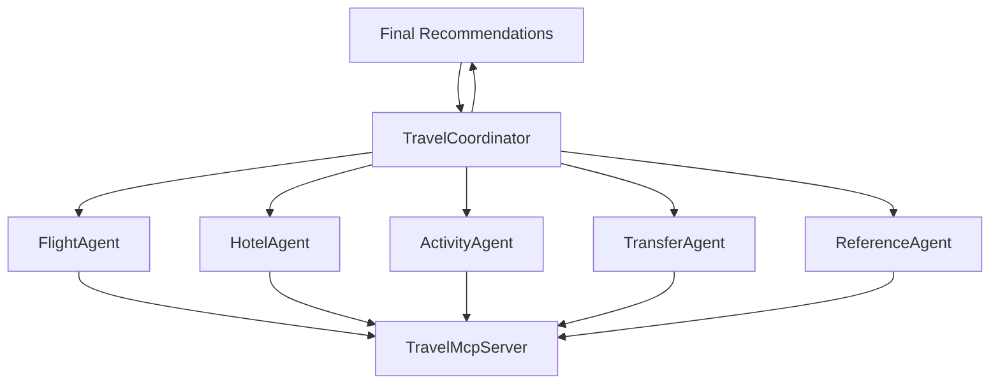

# Travel Multi-Agent Client

A Semantic Kernel-based multi-agent orchestrator for the TravelMcpServer, acting as a comprehensive Travel Agent Assistant.

## Overview

This project implements a sophisticated travel planning system using Microsoft Semantic Kernel's multi-agent framework. It coordinates multiple specialized agents to provide comprehensive travel assistance, from flight booking to activity recommendations.

## Architecture

### Multi-Agent System

The system consists of 6 specialized agents that work together in a coordinated chat group:

#### 🎯 TravelCoordinatorAgent
- **Role**: Main orchestrator and customer interface
- **Responsibilities**: 
  - Primary customer interaction
  - Request analysis and delegation
  - Travel plan synthesis
  - Budget estimation
  - Final recommendations

#### ✈️ FlightAgent
- **Role**: Flight search and booking specialist
- **Capabilities**:
  - Real-time flight searches
  - Price comparison across airlines
  - Route optimization
  - Travel class recommendations

#### 🏨 HotelAgent
- **Role**: Accommodation specialist
- **Capabilities**:
  - Hotel searches by city/location
  - Amenity filtering
  - Rating analysis
  - Value recommendations

#### 🎭 ActivityAgent
- **Role**: Tours and experiences specialist
- **Capabilities**:
  - Local activity discovery
  - Cultural experience recommendations
  - Point of interest searches
  - Interest-based filtering

#### 🚗 TransferAgent
- **Role**: Ground transportation specialist
- **Capabilities**:
  - Airport transfers
  - City transportation
  - Vehicle category selection
  - Hourly rentals

#### 📊 ReferenceAgent
- **Role**: Travel data and reference specialist
- **Capabilities**:
  - Airport/city code lookup
  - Location searches
  - Travel insights
  - Route information

## Features

### 🌟 Core Capabilities
- **Natural Language Processing**: Understands complex travel requests
- **Multi-Agent Coordination**: Specialized agents work together seamlessly
- **Real-Time Data**: Connects to TravelMcpServer for live travel information
- **Comprehensive Planning**: Handles flights, hotels, activities, and transfers
- **Budget Estimation**: Provides realistic cost projections
- **Interactive Chat**: Conversational interface for easy interaction

### 🛠️ Technical Features
- **Semantic Kernel Integration**: Leverages Microsoft's agent framework
- **OpenAI/Azure OpenAI Support**: Compatible with both AI services
- **Modular Architecture**: Easy to extend with new agents
- **Robust Error Handling**: Graceful failure management
- **Logging & Monitoring**: Comprehensive activity tracking

## Prerequisites

- .NET 8.0 SDK
- TravelMcpServer running (from Challenge-09)
- OpenAI API key or Azure OpenAI service
- Visual Studio 2022 or VS Code

## Configuration

### 1. API Keys Setup

Configure your AI service in `appsettings.json` or user secrets:

#### Option A: OpenAI
```json
{
  "OpenAI": {
    "ApiKey": "your-openai-api-key",
    "ModelId": "gpt-4o"
  }
}
```

#### Option B: Azure OpenAI
```json
{
  "AzureOpenAI": {
    "ApiKey": "your-azure-openai-key",
    "Endpoint": "https://your-resource.openai.azure.com/",
    "ModelId": "gpt-4o"
  }
}
```

### 2. TravelMcpServer Configuration

Ensure the TravelMcpServer is running and update the base URL if needed:

```json
{
  "TravelMcpServer": {
    "BaseUrl": "http://localhost:3000"
  }
}
```

## Getting Started

### 1. Start TravelMcpServer
```bash
cd ../TravelMCPServer
dotnet run
```

### 2. Run the Multi-Agent Client
```bash
cd TravelMultiAgentClient
dotnet run
```

### 3. Interact with the Travel Assistant

Example conversations:

```
You: I want to plan a 4-day trip to Paris from New York in March
```

```
You: Find me flights from NYC to London, hotels near the city center, and recommend some cultural activities
```

```
You: What's the budget for a family trip to Tokyo for 7 days?
```

## Example Use Cases

### 🌍 Complete Trip Planning
- "Plan a romantic weekend in Rome for two people"
- "I need a business trip to Tokyo with meetings downtown"
- "Family vacation to Orlando with kids aged 8 and 12"

### ✈️ Flight-Specific Requests
- "Find direct flights from LAX to CDG next Friday"
- "Compare business class options to Dubai"
- "Cheapest flights to Europe in April"

### 🏨 Accommodation Needs
- "Hotels near Times Square under $200/night"
- "Luxury resorts in Maldives with spa"
- "Family-friendly hotels in Barcelona"

### 🎭 Activity Planning
- "Food tours in Bangkok"
- "Museum recommendations in Paris"
- "Adventure activities in New Zealand"

## Agent Communication Flow



## Project Structure

```
TravelMultiAgentClient/
├── Agents/
│   ├── TravelCoordinatorAgent.cs    # Main orchestrator
│   ├── FlightAgent.cs               # Flight specialist
│   ├── HotelAgent.cs                # Hotel specialist
│   ├── ActivityAgent.cs             # Activity specialist
│   ├── TransferAgent.cs             # Transfer specialist
│   └── ReferenceAgent.cs            # Reference data specialist
├── Models/
│   └── TravelModels.cs              # Data models
├── Services/
│   └── McpClientService.cs          # MCP server communication
├── Program.cs                       # Main application
├── appsettings.json                 # Configuration
└── README.md                        # This file
```

## Dependencies

- **Microsoft.SemanticKernel** - Core AI orchestration framework
- **Microsoft.SemanticKernel.Agents.Core** - Multi-agent capabilities
- **Microsoft.SemanticKernel.Agents.OpenAI** - OpenAI integration
- **Microsoft.Extensions.*** - .NET hosting and configuration
- **System.Text.Json** - JSON serialization

## Development Notes

### Adding New Agents
1. Create a new agent class inheriting from `ChatCompletionAgent`
2. Implement specialized functions with `[KernelFunction]` attributes
3. Add the agent to the chat group in `Program.cs`
4. Update the coordinator's instructions to reference the new agent

### Extending Functionality
- Add new MCP server endpoints in `McpClientService`
- Create new data models in `TravelModels.cs`
- Implement additional agent functions for new capabilities

### Testing
- Unit tests can be added for individual agent functions
- Integration tests should verify MCP server connectivity
- End-to-end tests can validate complete travel planning scenarios

## Troubleshooting

### Common Issues

1. **MCP Server Connection**: Ensure TravelMcpServer is running on port 3000
2. **API Key Issues**: Verify OpenAI/Azure OpenAI configuration
3. **Agent Timeout**: Increase `MaximumIterations` in termination strategy
4. **JSON Parsing**: Check MCP server response formats

### Logging

The application provides detailed logging. Check console output for:
- Agent initialization status
- MCP server communication
- Error details and stack traces

## Future Enhancements

- 🔐 **Authentication & Authorization**: User account management
- 💾 **State Persistence**: Save and resume conversations
- 📱 **Web Interface**: Browser-based chat interface
- 🌐 **Multi-Language**: International language support
- 📈 **Analytics**: Usage patterns and performance metrics
- 🔄 **Booking Integration**: Complete end-to-end booking
- 🎯 **Personalization**: User preference learning

## Contributing

1. Fork the repository
2. Create a feature branch
3. Implement your changes
4. Add appropriate tests
5. Submit a pull request

## License

This project is part of the Developing Agentic AI Apps Hackathon solution.