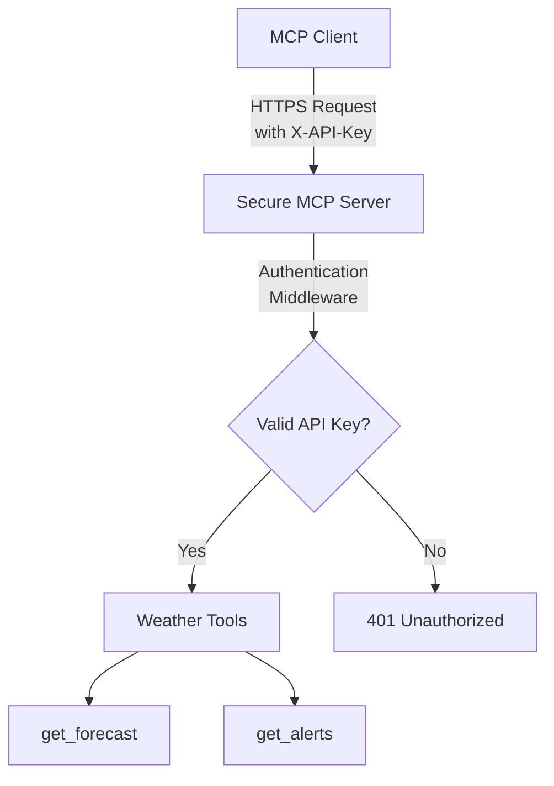

# Challenge 09 Solution - Secure your MCP remote server using an API key

This directory contains the complete Python solution for Challenge 09, which demonstrates how to secure an MCP server with API key authentication and build a client that connects to it securely.

## What's Included

- **secure_weather_server.py**: Secure MCP server with API key authentication
- **secure_weather_client.py**: MCP client that authenticates with the secured server
- **requirements.txt**: All dependencies for both server and client
- **.env.example**: Configuration template with all necessary environment variables

## Solution Overview

This solution demonstrates:

1. **API Key Authentication**: Implementing secure header-based authentication
2. **Middleware Protection**: Using FastAPI/Starlette middleware for centralized auth
3. **Remote MCP Server**: Converting stdio MCP server to HTTP/SSE transport
4. **Secure Client**: Building a client that includes authentication credentials
5. **Security Best Practices**: Following security guidelines for production deployment
6. **Agent Integration**: Using Microsoft Agent Framework for natural language queries

## Key Security Features

- **API Key Authentication**: Custom ASGI middleware validates X-API-Key header
- **Protected Endpoints**: MCP endpoints require authentication
- **Public Endpoints**: Health checks remain accessible for monitoring
- **Environment Variables**: Secrets stored securely, not in code
- **HTTPS Ready**: Works with HTTPS endpoints for encrypted communication
- **Error Handling**: Proper error messages without leaking sensitive data
- **MCP Debug Logging**: Orange [MCP] messages to stderr for connection tracking

## Architecture



The client sends requests with an X-API-Key header to the remote server. The server validates the key via middleware before allowing access to MCP tools. This architecture enables secure remote access while maintaining the MCP protocol's functionality.

## Getting Started

### Prerequisites

1. **Python 3.10+**: Modern Python version with async support
2. **Azure OpenAI Resource**: Deployed GPT-4 or GPT-4o model (for client)
3. **pip**: Package installer for Python dependencies

### Installation

```bash
# Create virtual environment (recommended)
python -m venv .venv

# Activate virtual environment
source .venv/bin/activate  # On Windows: .venv\Scripts\activate

# Install all dependencies
pip install -r requirements.txt
```

### Configuration

```bash
# Copy the example environment file
cp .env.example .env
```

Edit `.env` and configure the following:

**Server Settings:**
```bash
API_KEY=SuperSecureSecretUsedAsApiKey1  # Authentication key
PORT=5000                                # Server port (optional)
```

**Client Settings:**
```bash
# Azure OpenAI
AZURE_OPENAI_ENDPOINT=https://your-resource-name.openai.azure.com/
AZURE_OPENAI_API_KEY=your_azure_openai_api_key_here
AZURE_OPENAI_DEPLOYMENT_NAME=gpt-4

# MCP Server
USE_LOCAL_MCP=false
MCP_SERVER_URL=http://localhost:5000
API_KEY=SuperSecureSecretUsedAsApiKey1  # Must match server
```

**Important**: The `API_KEY` must be identical in both server and client configurations.

## Running the Solution

### Step 1: Start the Server

In one terminal:

```bash
python secure_weather_server.py
```

Expected output:
```
====================================================================
Secure Weather MCP Server - Challenge 09 Solution
====================================================================
Starting server on port 5000
API Key authentication: ENABLED
Protected endpoints: /mcp/*
Public endpoints: /, /health
====================================================================
INFO:     Uvicorn running on http://0.0.0.0:5000
```

### Step 2: Test the Server (Optional)

```bash
# Test public endpoints (no auth required)
curl http://localhost:5000/health
curl http://localhost:5000/

# Test protected endpoint without API key (should fail)
curl http://localhost:5000/mcp/tools

# Test protected endpoint with API key (should succeed)
curl -H "X-API-Key: SuperSecureSecretUsedAsApiKey1" \
     http://localhost:5000/mcp/tools
```

### Step 3: Run the Client

In another terminal (with server still running):

```bash
python secure_weather_client.py
```

Expected output:
```
====================================================================
Secure MCP Weather Client - Challenge 09 Solution
====================================================================

[OK] Configuration loaded
  - MCP Server: http://localhost:5000/mcp
  - Azure OpenAI: gpt-4

[OK] Azure OpenAI client initialized
[OK] Secure MCP tool configured with API key authentication
[OK] Agent initialized with secure MCP access

Ask weather questions like:
  - What's the weather in Seattle?
  - Are there any alerts for California?
  - Get forecast for latitude 40.7128, longitude -74.0060

Type 'exit' or 'quit' to end the session
====================================================================

You:
```

You'll also see orange `[MCP]` debug messages on stderr showing:
- Connection to MCP server with host and port
- Tool calls and arguments when agent uses MCP tools
- Tool responses when data is received from server

## Usage Examples

**Get Weather Forecast:**
```
You: What's the weather forecast for Seattle?
Agent: [Calls get_forecast tool and returns detailed weather information]
```

*Debug output (stderr):*
```
[MCP] Calling tool: get_forecast
[MCP] Tool arguments: {"latitude": 47.6062, "longitude": -122.3321}
[MCP] Tool response received (length: 1234 chars)
```

**Check Weather Alerts:**
```
You: Are there any severe weather alerts for California?
Agent: [Calls get_alerts tool and returns any active alerts]
```

*Debug output (stderr):*
```
[MCP] Calling tool: get_alerts
[MCP] Tool arguments: {"state": "CA"}
[MCP] Tool response received (length: 567 chars)
```

**Exit:**
```
You: exit
Goodbye! Disconnecting from secure MCP server...
```

*Debug output (stderr):*
```
[MCP] Disconnecting from MCP server
```

## How It Works

### Server Implementation

**Authentication Middleware:**
```python
class ApiKeyAuthMiddleware:
    """Pure ASGI middleware for API key validation."""
    async def __call__(self, scope, receive, send):
        # Check if path requires authentication
        # Validate X-API-Key header from scope["headers"]
        # Return 401 if invalid, or proceed if valid
```

**Protected Routes:**
- `/mcp/*` - Requires X-API-Key header
- `/` and `/health` - Public, no authentication required

**Weather Tools:**
- `get_forecast(latitude, longitude)` - Get detailed weather forecast
- `get_alerts(state)` - Get active weather alerts for a US state

### Client Implementation

**MCP Debug Logging:**
```python
# ANSI color codes for orange text
ORANGE = "\033[38;5;208m"
RESET = "\033[0m"

def mcp_debug(message: str) -> None:
    """Print MCP debug messages to stderr in orange."""
    print(f"{ORANGE}[MCP] {message}{RESET}", file=sys.stderr, flush=True)
```

**API Key Injection:**
```python
mcp_tool = MCPStreamableHTTPTool(
    name="WeatherMCP",
    url=remote_server_url,
    headers={"X-API-Key": api_key}  # Automatically added to every request
)
```

**Tool Call Tracking:**
```python
async for update in agent.run_stream(user_query):
    # Log MCP tool calls with hasattr checks
    if hasattr(update, 'tool_calls') and update.tool_calls:
        for tool_call in update.tool_calls:
            mcp_debug(f"Calling tool: {tool_call.function.name}")
            mcp_debug(f"Tool arguments: {tool_call.function.arguments}")

    # Log MCP tool responses
    if hasattr(update, 'tool_call_results') and update.tool_call_results:
        for result in update.tool_call_results:
            mcp_debug(f"Tool response received (length: {len(str(result.content))} chars)")
```

**Agent Integration:**
- Uses Microsoft Agent Framework
- Automatic tool selection based on queries
- Streaming responses for real-time feedback

## Troubleshooting

### Server Issues

**Port already in use:**
```bash
# Change PORT in .env file
PORT=5000
```
### Client Issues

**401 Unauthorized:**
- Verify `API_KEY` gets the same value in both server/client
- Check for extra spaces or quotes in the key
- Ensure server is running and accessible

**Connection refused:**
- Confirm server is running
- Verify `MCP_SERVER_URL` points to correct address
- Check port number matches

**Azure OpenAI errors:**
- Validate all `AZURE_OPENAI_*` variables are set
- Check endpoint URL format (include trailing slash)
- Verify API key is correct

## Security Considerations

### Development
- API keys stored in .env file (git-ignored)
- Clear separation between public and protected endpoints
- Proper HTTP status codes and error messages

### Production
- Use Azure Key Vault or similar for secret storage
- Always use HTTPS, never HTTP
- Implement rate limiting per API key
- Add comprehensive logging and monitoring
- Support key rotation with multiple active keys
- Consider upgrading to OAuth 2.0/OIDC

## Project Structure

```
Challenge-09/python/
├── secure_weather_server.py    # MCP server with authentication
├── secure_weather_client.py    # MCP client with authentication
├── requirements.txt             # All dependencies
├── .env.example                 # Configuration template
├── .env                         # Your config (git-ignored)
├── .gitignore                   # Protects secrets
└── README.md                    # This file
```

## Next Steps

After completing this solution, consider:

1. **Deploy to Cloud**: Azure Container Apps or Azure Functions
2. **Add Key Management**: Integrate with Azure Key Vault
3. **Upgrade Authentication**: Implement OAuth 2.0/OIDC
4. **Add Rate Limiting**: Protect against abuse
5. **Implement Logging**: Comprehensive audit logging
6. **Add More Tools**: Expand MCP server functionality

## Additional Resources

- [FastAPI Documentation](https://fastapi.tiangolo.com/)
- [MCP Specification](https://modelcontextprotocol.io/)
- [Microsoft Agent Framework](https://github.com/microsoft/agents)
- [Azure OpenAI Service](https://azure.microsoft.com/en-us/products/ai-services/openai-service)
