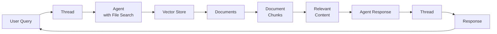
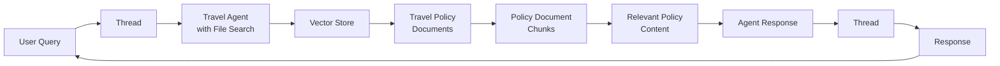

# Challenge 05 - C# - Build your first AI Agent with AI Agents Service

 [< Previous Challenge](./Challenge-04-csharp.md) - **[Home](../README.md)** - [Next Challenge >](./Challenge-06-csharp.md)
 
[](Challenge-05-csharp.md)
[](Challenge-05-python.md)

## Introduction

In this challenge, you'll build your first AI Agent using Azure AI Agents Service with file search capabilities. You'll create a **Travel Policy Compliance Agent** that can analyze and answer questions about your company's travel policy using intelligent document retrieval.

## Concepts

Before diving into the implementation, let's understand the key concepts of Azure AI Agent Service

### Azure AI Agents Service

Azure AI Agents Service provides a managed platform for building and deploying AI agents with advanced capabilities. Key features include:

- **Managed Agent Hosting**: Azure handles the infrastructure, scaling, and management of your AI agents
- **Built-in Tools**: Pre-configured tools for file search, function calling, and code interpretation
- **Persistent Conversations**: Maintain context across multiple interactions with thread management
- **Secure Authentication**: Integrated Azure Identity for secure access control

### File Search and Vector Stores

File search capability enables your agent to retrieve relevant information from uploaded documents:

- **Vector Stores**: Azure-managed storage for documents that are automatically chunked, embedded, and indexed
- **Semantic Search**: Find relevant content based on meaning, not just keyword matching
- **Retrieval-Augmented Generation (RAG)**: Combine document retrieval with AI generation for accurate, contextual responses
- **Document Processing**: Automatic handling of various file formats (PDF, DOCX, TXT, etc.)

### Persistent Agents and Threads

Understanding the agent interaction model:

- **Persistent Agents**: AI agents that maintain their configuration and capabilities across sessions
- **Threads**: Conversation contexts that preserve message history and state
- **Runs**: Individual executions of agent processing within a thread
- **Messages**: User inputs and agent responses within a conversation thread

### AI Agent Architecture

The general architecture for AI agents with file search follows this pattern:



## Description

This challenge is divided into two main tasks that will guide you through creating a simple Travel Policy Compliance Agent solution.

### About the Travel Policy Compliance Agent

You'll build a specialized AI agent that acts as a compliance advisor for company travel policies. This agent will:

**Core Capabilities:**

- **Policy Interpretation**: Explain complex policy rules in simple terms
- **Expense Validation**: Check if expenses comply with policy limits
- **Booking Guidance**: Provide recommendations for compliant travel bookings
- **Exception Handling**: Explain when and how to request policy exceptions

**Agent Architecture for This Challenge:**



The agent will use the company travel policy document as its knowledge base to provide accurate, policy-compliant guidance to employees.

### Task 1: Create and Configure the Agent in Azure AI Foundry

Your first task is to set up the AI agent using the Azure AI Foundry portal:

1. **Create an AI Agent in Azure AI Foundry**
   - Navigate to the Azure AI Foundry portal
   - Create a new AI agent with file search capabilities enabled
   - Configure the agent with the following instructions:

   ```text
   You are a Travel Compliance Policy Agent for a company. Your role is to review, validate, and enforce the company's travel policy by evaluating travel requests, itineraries, and expense reports. You must ensure all travel activities comply with the policy's rules, financial limits, and approval workflows.
   ```

2. **Set Up File Search Knowledge Base**
   - Add file search as a knowledge source for your agent
   - Create a new vector store to hold the travel policy documents
   - Upload the company travel policy document located at `Student\Resources\Challenge-05\company_travel_policy.docx`
   - Ensure the document is properly indexed and searchable

3. **Test in the Playground**
   - Use the Azure AI Foundry playground to test your agent
   - Ask sample questions about travel policies to verify the agent can retrieve relevant information
   - Validate that the agent provides accurate responses based on the uploaded document
   - Test various scenarios like expense limits  and booking requirements

**Sample Test Queries for the Playground:**

- "What is the maximum daily allowance for meals when traveling domestically?"
- "Do I need approval for international flights?"
- "What hotels am I allowed to book?"
- "Can I book first-class flights?"
- "What documents do I need to submit for expense reimbursement?"

### Task 2: Build the Console Application

Your second task is to create a C# console application that integrates with your configured agent:

**Project Starter Available:**
A starter project is provided at `Student\Resources\Challenge-05\csharp` to help you get started. However, you'll need to complete the code implementation to establish the conversation flow with your Agent created in previous task

1. **Console Application Development**
   - Use the provided starter project or build a C# console application from scratch using the Azure AI Projects SDK
   - Implement proper authentication using Azure credentials
   - Connect to your configured AI agent from previous task
   - Complete the code to enable full conversation functionality

2. **Interactive Interface Implementation**
   - Create an interactive conversation interface
   - Handle user input and display agent responses
   - Implement proper error handling for API failures
   - Provide clear user instructions and feedback

3. **Agent Integration**
   - Establish connection to your Azure AI agent
   - Manage conversation threads and message handling
   - Ensure the console app can access the file search capabilities you configured

**Sample C# Code to Get Started:**

Use this code as a foundation for your console application. Remember to replace the endpoint URL and agent ID with your actual values from previous task.

**💡 Tip:** You can also find similar code samples by clicking the **"View Code"** button in the Azure AI Foundry Agent playground after testing your agent.

```csharp
using Azure;
using Azure.Identity;
using Azure.AI.Projects;
using Azure.AI.Agents.Persistent;

async Task RunAgentConversation()
{
    var endpoint = new Uri("<YOUR_AZURE_AI_FOUNDRY_PROJECT_ENDPOINT<>");
    AIProjectClient projectClient = new(endpoint, new DefaultAzureCredential());

    PersistentAgentsClient agentsClient = projectClient.GetPersistentAgentsClient();

    PersistentAgent agent = agentsClient.Administration.GetAgent("<Your_Agent_ID>");
    
    PersistentAgentThread thread = agentsClient.Threads.CreateThread();
    Console.WriteLine($"Created thread, ID: {thread.Id}");

    PersistentThreadMessage messageResponse = agentsClient.Messages.CreateMessage(
        thread.Id,
        MessageRole.User,
        "Hi AgentWorkshop");

    ThreadRun run = agentsClient.Runs.CreateRun(
        thread.Id,
        agent.Id);

    // Poll until the run reaches a terminal status
    do
    {
        await Task.Delay(TimeSpan.FromMilliseconds(500));
        run = agentsClient.Runs.GetRun(thread.Id, run.Id);
    }
    while (run.Status == RunStatus.Queued
        || run.Status == RunStatus.InProgress);
    if (run.Status != RunStatus.Completed)
    {
        throw new InvalidOperationException($"Run failed or was canceled: {run.LastError?.Message}");
    }

    Pageable<PersistentThreadMessage> messages = agentsClient.Messages.GetMessages(
        thread.Id, order: ListSortOrder.Ascending);

    // Display messages
    foreach (PersistentThreadMessage threadMessage in messages)
    {
        Console.Write($"{threadMessage.CreatedAt:yyyy-MM-dd HH:mm:ss} - {threadMessage.Role,10}: ");
        foreach (MessageContent contentItem in threadMessage.ContentItems)
        {
            if (contentItem is MessageTextContent textItem)
            {
                Console.Write(textItem.Text);
            }
            else if (contentItem is MessageImageFileContent imageFileItem)
            {
                Console.Write($"<image from ID: {imageFileItem.FileId}");
            }
            Console.WriteLine();
        }
    }
}

// Main execution
await RunAgentConversation();
```

**Important Notes:**

- Replace the endpoint URL with your Azure AI Foundry project endpoint
- Replace the agent ID with the ID of the agent you created in Task 1
- This code demonstrates a single conversation - extend it to create an interactive loop for continuous user input

### What You'll Deliver

After completing both tasks, you will have:

- **A configured AI agent** in Azure AI Foundry with file search capabilities and travel policy knowledge
- **A working console application** that provides an interactive interface to query travel policy information
- **A complete solution** that demonstrates enterprise AI agent capabilities with document-based knowledge retrieval

### Sample Interactions

Your Travel Policy Compliance Agent should be able to handle queries like:

```text
User: "What is the maximum daily allowance for meals when traveling domestically?"
Agent: "According to the company travel policy, the maximum daily meal allowance for domestic travel is $75 per day, which includes breakfast ($15), lunch ($25), and dinner ($35)."

User: "Do I need approval for international flights?"
Agent: "Yes, according to the travel policy, all international travel requires pre-approval from your manager and the travel department at least 2 weeks before departure."

User: "What hotels am I allowed to book?"
Agent: "The travel policy requires you to book accommodations at approved corporate rates when available. For domestic travel, the maximum nightly rate is $200 in major cities and $150 in other locations."
```

## Success Criteria

- ✅ Successfully created and configured an AI agent in Azure AI Foundry with file search capabilities and travel policy knowledge
- ✅ Validated that you uploaded and indexed the travel policy document in a vector store for searchable content
- ✅ Demonstrated agent functionality by testing it in the Azure AI Foundry playground to validate policy-based responses
- ✅ Successfully built a working console application that connects to your agent and provides an interactive interface
- ✅ Validated policy compliance functionality by ensuring the agent accurately answers travel policy questions

## Learning Resources

### Azure AI Agents Service Documentation

- [Azure AI Agents Service Overview](https://learn.microsoft.com/en-us/azure/ai-foundry/agents/overview)
- [Azure AI Agents Service Concepts](https://learn.microsoft.com/en-us/azure/ai-foundry/agents/concepts/threads-runs-messages)
- [File Search with AI Agents](https://learn.microsoft.com/en-us/azure/ai-foundry/agents/how-to/tools/file-search)

### Sample Code and Tutorials

- [Azure AI Foundry Samples - C#](https://github.com/azure-ai-foundry/foundry-samples/tree/main/samples/microsoft/csharp/getting-started-agents)
- [Azure AI Foundry Samples - Python](https://github.com/azure-ai-foundry/foundry-samples/tree/main/samples/microsoft/python/getting-started-agents)