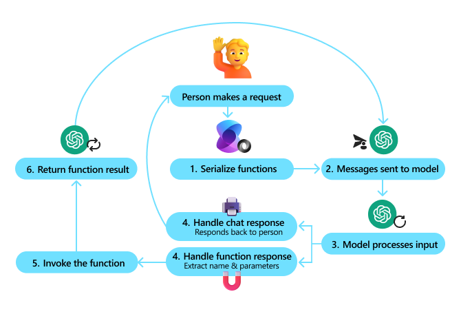

# Challenge 06 - Build your first Semantic Kernel App and integrate with MCP remote server

 [< Previous Challenge](./Challenge-05.md) - **[Home](../README.md)** - [Next Challenge >](./Challenge-07.md)

## Introduction

In this challenge, you will build your first intelligent application using **Semantic Kernel**, Microsoft's lightweight SDK for developing AI agents. You'll create an interactive console application that demonstrates the core capabilities of AI orchestration and plugin integration.

Semantic Kernel serves as middleware between your application and AI models, enabling you to build enterprise-grade AI solutions. By the end of this challenge, you'll have hands-on experience with plugins, function calling, and integrating external services through the Model Context Protocol (MCP).

Semantic Kernel combines prompts with existing APIs to perform actions. By describing your existing code to AI models, they’ll be called to address requests. When a request is made the model calls a function, and Semantic Kernel is the middleware translating the model's request to a function call and passes the results back to the model.



In this challenge, you'll build a console application that can control smart devices, display current time, and fetch weather data from your remote MCP server, showcasing how Semantic Kernel orchestrates multiple AI capabilities seamlessly.

## Concepts

Before diving into the implementation, let's understand the key concepts that make Semantic Kernel powerful for AI development.

### Semantic Kernel Architecture

Semantic Kernel provides a structured approach to AI application development:

- **Kernel**: The central orchestration engine that manages AI services, plugins, and execution
- **AI Services**: Integration points with AI models (OpenAI, Azure OpenAI, etc.)
- **Plugins**: Reusable components that extend the kernel's capabilities
- **Function Calling**: The mechanism that allows AI models to execute your code
- **Planning**: Automatic orchestration of multiple function calls to complete complex tasks

### Plugins and Function Calling

Plugins are the building blocks of Semantic Kernel applications:

- **KernelFunction**: Individual functions that can be called by the AI
- **Function Descriptions**: Metadata that helps the AI understand when and how to use functions
- **Parameters**: Strongly-typed inputs and outputs for reliable function execution
- **Auto Function Calling**: AI models automatically decide which functions to call based on user intent

### Integration with Model Context Protocol (MCP)

Semantic Kernel can integrate with MCP servers to extend functionality:

- **MCP Client Integration**: Connect to remote MCP servers as additional capability sources
- **Tool Registration**: Convert MCP tools into Semantic Kernel functions
- **Hybrid Architecture**: Combine local plugins with remote MCP services
- **Scalable Design**: Leverage both local processing and cloud-based services

### Agent Support and Framework

Semantic Kernel provides comprehensive support for building intelligent agents:

- **Agent Framework**: Built-in abstractions for creating conversational AI agents with persistent state
- **Multi-Agent Systems**: Support for orchestrating multiple specialized agents working together
- **Agent Memory**: Persistent conversation history and context management across sessions
- **Agent Personas**: Define agent behavior, personality, and specialized knowledge domains
- **Collaborative Agents**: Enable agents to delegate tasks and share information with other agents
- **Agent Lifecycle Management**: Handle agent initialization, state management, and cleanup operations

## Description

This challenge will guide you through the process of developing your first intelligent app with Semantic Kernel.

In just a few steps, you can build your first AI agent with Semantic Kernel in either .NET.

### Task 1: Light Bulb interaction plugin

As a starting point you can follow the steps below to start development with Semantic Kernel. In this .NET console application example, you will create a plugin, allowing the AI agent to interact with a light bulb.

If you are not familiar enough with .NET you can use the supported programming language (Python or Java) of your preference.

In a console window, use the dotnet new command to create a new console app:

```bash
dotnet new console -n azure-semantic-kernel-sdk-hackathon
```

#### Install the SDK and add Logging package

```bash
dotnet add package Microsoft.SemanticKernel
dotnet add package Microsoft.Extensions.Logging.Console
```

#### Import packages

```csharp
using Microsoft.SemanticKernel;
using Microsoft.SemanticKernel.ChatCompletion;
using Microsoft.SemanticKernel.Connectors.OpenAI;
using Microsoft.Extensions.DependencyInjection;
using Microsoft.Extensions.Logging;
using System.Text.Json.Serialization;
```

#### Add AI services

```csharp
// Create kernel
var builder = Kernel.CreateBuilder();
builder.AddAzureOpenAIChatCompletion(modelId, endpoint, apiKey);
```

#### Add enterprise services

One of the main benefits of using Semantic Kernel is that it supports enterprise-grade services. In this sample, we added the logging service to the kernel to help debug the AI agent.

```csharp
//Disable the experimental warning
#pragma warning disable SKEXP0001

builder.Services.AddLogging(services => services.AddConsole().SetMinimumLevel(LogLevel.Trace));
```

**Build the kernel and retrieve services.** Once the services have been added, we  build the kernel and retrieve the chat completion service for later use.

```csharp
Kernel kernel = builder.Build();

// Retrieve the chat completion service
var chatCompletionService = kernel.Services.GetRequiredService<IChatCompletionService>();
```

#### Add plugins

With plugins, you can give your AI agent the ability to run your code to retrieve information from external sources or to perform actions. In the example above, we'll add a plugin that allows the AI agent to interact with a light bulb. You should place your Plugins in a separate folder.

In your own code, you can create a plugin that interacts with any external service or API to achieve similar results.

A good practice is to structure your Plugins in the project like this:

```bash
\Plugins
    \LightsPlugin
        - LightsPlugin.cs
```

```csharp
using System.ComponentModel;
using Microsoft.SemanticKernel;
using System.Linq;

public class LightsPlugin
{
// Mock data for the lights
private readonly List<LightModel> lights = new()
{
    new LightModel { Id = 1, Name = "Table Lamp", IsOn = false },
    new LightModel { Id = 2, Name = "Porch light", IsOn = false },
    new LightModel { Id = 3, Name = "Chandelier", IsOn = true }
};

[KernelFunction("get_lights")]
[Description("Gets a list of lights and their current state")]
[return: Description("An array of lights")]
public async Task<List<LightModel>> GetLightsAsync()
{
    return lights;
}

[KernelFunction("change_state")]
[Description("Changes the state of the light")]
[return: Description("The updated state of the light; will return null if the light does not exist")]
public async Task<LightModel?> ChangeStateAsync(int id, bool isOn)
{
    var light = lights.FirstOrDefault(light => light.Id == id);

    if (light == null)
    {
        return null;
    }

    // Update the light with the new state
    light.IsOn = isOn;

    return light;
}
}

public class LightModel
{
[JsonPropertyName("id")]
public int Id { get; set; }

[JsonPropertyName("name")]
public string Name { get; set; }

[JsonPropertyName("is_on")]
public bool? IsOn { get; set; }
}
```

#### Add the plugin to the kernel

Once you've created your plugin, you can add it to the kernel so the AI agent can access it. In the sample, we added the LightsPlugin class to the kernel.

```csharp
// Add the plugin to the kernel
kernel.Plugins.AddFromType<LightsPlugin>("Lights");
```

#### Planning

Semantic Kernel leverages function calling–a native feature of most LLMs–to provide planning. With function calling, LLMs can request (or call) a particular function to satisfy a user's request. Semantic Kernel then marshals the request to the appropriate function in your codebase and returns the results back to the LLM so the AI agent can generate a final response.

To enable automatic function calling, we first need to create the appropriate execution settings so that Semantic Kernel knows to automatically invoke the functions in the kernel when the AI agent requests them.

```csharp
OpenAIPromptExecutionSettings openAIPromptExecutionSettings = new()
{
    FunctionChoiceBehavior = FunctionChoiceBehavior.Auto()
};
```

#### Invoke the plugin

Finally, we invoke the AI agent with the plugin. The sample code demonstrates how to generate a non-streaming response, but you can also generate a streaming response by using the GetStreamingChatMessageContentAsync method.

```csharp
// Create chat history
var history = new ChatHistory();

// Get the response from the AI
var result = await chatCompletionService.GetChatMessageContentAsync(
history,
executionSettings: openAIPromptExecutionSettings,
kernel: kernel
);
```

### Task 2: Current time plugin

In this task, you will create a plugin that allows the AI agent to display the current time. Since large language models (LLMs) are trained on past data and do not have real-time capabilities, they cannot provide the current time on their own.

By creating this plugin, you will enable the AI agent to call a function that retrieves and displays the current time.

### Task 3: Integrate with Weather Remote MCP server

In this task you will integrate the Weather MCP Remote server completed in the previous challenge and add it as plugins in Semantic Kernel.

Initialize the MCP client with the following code:

```csharp
var mcpServerUrl = "Your remote MCP server endpoint";

_mcpClient = await McpClientFactory.CreateAsync(
    new SseClientTransport(
        new SseClientTransportOptions
        {
            Endpoint = new Uri(mcpServerUrl),
            ConnectionTimeout = TimeSpan.FromMinutes(5) // Increase MCP connection timeout to 5 minutes
        }
    )
);
```

After creating the MCP client, you will get the list of tools and add them to Semantic Kernel:

```csharp
var mcpTools = await _mcpClient.ListToolsAsync();

//List available MCP tools
Console.WriteLine("Available MCP Tools:");
foreach (var tool in mcpTools)
{
    Console.WriteLine($"- {tool.Name}: {tool.Description}");
}

//Register MCP tools to kernel
kernel.Plugins.AddFromFunctions("WeatherTools", mcpTools.Select(t => t.AsKernelFunction()));
```

## Success Criteria

- ✅ Ensure that your application is running and you are able to debug the application.
- ✅ Ensure that you can interact with the application and switch on or off the light bulbs.
- ✅ Ensure that you are able to request the current time and receive an accurate response.
- ✅ Set a break point in one of the plugins and hit the break point with a user prompt
- ✅ Debug and inspect the chat history object to see the sequence of function calls and results.
- ✅ Integrate with MCP Remote server and get weather results.
- ✅ Demonstrate that the user can ask questions about weather data through the integrated MCP server.

## Learning Resources

- [Introduction to Semantic Kernel | Microsoft Learn](https://learn.microsoft.com/en-us/semantic-kernel/overview/)
- [Plugins in Semantic Kernel | Microsoft Learn](https://learn.microsoft.com/en-us/semantic-kernel/concepts/plugins/?pivots=programming-language-csharp)
- [What are Planners in Semantic Kernel | Microsoft Learn](https://learn.microsoft.com/en-us/semantic-kernel/concepts/planning?pivots=programming-language-csharp)
- [In-depth Semantic Kernel Demos | Microsoft Learn](https://learn.microsoft.com/en-us/semantic-kernel/get-started/detailed-samples?pivots=programming-language-csharp)
- [Semantic Kernel GitHub](https://github.com/microsoft/semantic-kernel)
- [Add MCP Plugins](https://learn.microsoft.com/en-us/semantic-kernel/concepts/plugins/adding-mcp-plugins?pivots=programming-language-csharp)
- [GitHub samples, Azure AI Search](https://github.com/microsoft/semantic-kernel/blob/main/dotnet/samples/Concepts/Search/MyAzureAISearchPlugin.cs)
