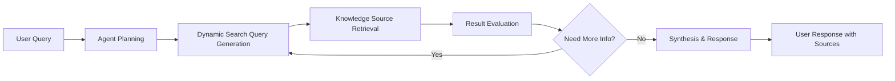

# Challenge 10 - C# - Build Agentic RAG with Azure AI Search

[< Previous Challenge](./Challenge-09-csharp.md) - **[Home](../README.md)**

[](Challenge-10-csharp.md)
[](Challenge-10-python.md)


## Introduction

In this challenge, you'll build an advanced **agentic Retrieval-Augmented Generation (RAG)** system using Azure AI Search. Unlike traditional RAG approaches that only retrieve and concatenate content, agentic retrieval allows the AI to decide what to retrieve, when to retrieve it, and how to iteratively refine its search strategy to answer complex, multi-part questions.

You will implement a conversational AI system that can:
- Dynamically search a knowledge base
- Reason about intermediate retrieval results
- Perform iterative refinement when information is incomplete
- Synthesize a grounded answer with cited sources

Throughout the process, you can inspect activities to understand how the agent planned, searched, and constructed its final response.

## Concepts

Before diving into the implementation, let's understand the key concepts that make agentic retrieval powerful for modern AI applications.

### Agentic Retrieval vs. Traditional RAG

**Traditional RAG** typically features:

- Fixed similarity search per user prompt
- Limited reasoning about missing context
- Static chunk retrieval (one-shot)
- Blind concatenation of results

**Agentic Retrieval** enables:

- **Dynamic Query Planning** – the agent decomposes or reformulates queries
- **Iterative Refinement** – additional searches when gaps remain
- **Contextual Reasoning** – awareness of sufficiency vs. insufficiency
- **Grounded Synthesis** – combines sources while preserving attribution

### Agentic Retrieval Workflow


### Azure AI Search Knowledge Agents

Azure AI Search provides native support for agentic retrieval through the following capabilities:

- **Knowledge Sources**: Structured data repositories an agent can query
- **Knowledge Agents**: Orchestrators that retrieve, reason, and synthesize
- **Retrieval Orchestration**: Coordination of multi-step query execution
- **Activity Tracking**: Logs of decision paths and retrieval operations


### Enterprise Knowledge Integration

Agentic retrieval enables enterprise scenarios such as:

- **Multi-Source Knowledge**: Unified retrieval across documents, databases, APIs
- **Contextual Understanding**: Domain-aware reasoning about user intent
- **Auditability**: Trace how each answer was formed
- **Source Attribution**: Cite underlying documents for verification
- **Security Alignment**: Honor data governance and access control boundaries

## Description
In this challenge, you'll complete a partially implemented agentic RAG system that demonstrates how AI agents can intelligently search through a knowledge base about "Earth at Night" using NASA data. The system showcases advanced retrieval capabilities in which the agent decides what to search for and how to synthesize the results.

You'll work with the [starter project](./Resources/Challenge-10/AgenticRAG). The conversational interface is already implemented; your objective is to complete the core agentic retrieval workflow powered by Azure AI Search.

### Task 1: Set Up Azure Resources

Create and configure the required Azure services for agentic retrieval.

1. **Create Azure AI Search Service**:
   - Create a new Azure AI Search service in the Azure portal
   - Choose a Standard tier or higher to support vector search and semantic capabilities

2. **Deploy required models**:
    - Chat completion model (for reasoning and synthesis), for example `gpt-4o`
    - Embedding model (for vector search), for example `text-embedding-ada-002`

### Task 2: Configure Access and Set Up Permissions

Azure AI Search agentic retrieval requires that the Search service can call Azure OpenAI. Configure these permissions:

For **Azure AI Search**:
- Enable role-based access control (RBAC) on the Search service.
- Enable a system-assigned managed identity.
- Assign these roles to yourself (development convenience): `Search Service Contributor`, `Search Index Data Contributor`, `Search Index Data Reader`.

For **Azure OpenAI**:
- Assign the `Cognitive Services OpenAI User` role to the Search service's managed identity.

### Task 3: Configure the Application

Navigate to the starter project and configure your Azure service settings.

1. **Open the starter project**:

```bash
cd Student/Resources/Challenge-10/AgenticRAG
```

2. **Update `appsettings.json`** with your Azure service configurations:

   ```json
   {
     "AzureOpenAI": {
       "Endpoint": "https://your-openai-service.openai.azure.com",
       "ApiKey": "your-openai-api-key",
       "DeploymentName": "gpt-4o",
       "Model": "gpt-4o",
       "EmbeddingsDeploymentName": "text-embedding-ada-002",
       "EmbeddingsModel": "text-embedding-ada-002"
     },
     "AzureAISearch": {
       "Endpoint": "https://your-search-service.search.windows.net",
       "SearchKey": "your-search-admin-key",
       "IndexName": "nasa-earth-night-index",
       "KnowledgeSourceName": "nasa-knowledge-source",
       "KnowledgeAgentName": "earth-night-agent"
     }
   }
   ```

### Task 4: Implement Agentic Retrieval Components

Implement four core components:

1. **Search Index** – Create index fields (id, chunk content, embedding vector, page number) plus semantic and vector configurations.
2. **Data Ingestion** – Upload NASA “Earth at Night” dataset into the index.
3. **Knowledge Source** – Reference the index and specify included fields.
4. **Knowledge Agent** – Bridge OpenAI deployments and knowledge source for multi-step retrieval & synthesis.

> **Reference Guide**: For detailed implementation steps and code examples, you can reference the [Azure AI Search agentic retrieval quickstart guide](https://learn.microsoft.com/en-us/azure/search/search-get-started-agentic-retrieval?tabs=search-perms%2Csearch-endpoint&pivots=programming-language-csharp) which provides comprehensive examples for each component.

#### 4.1 Create a Search Index

Create a search index. The index schema contains fields for document identification and page content, embeddings, and numbers. The schema also includes configurations for semantic ranking and vector search, which uses your embeddings deployment to vectorize text and match documents based on semantic or conceptual similarity.

You can create the search index programmatically (as shown below) or by using the **Azure portal**. In the Azure portal, navigate to your Azure AI Search resource, select **Indexes**, and use the UI to define fields, semantic settings, and vector search configurations. This provides a visual way to set up your index if you prefer not to use code.

```csharp
// Define fields for the index
var fields = new List<SearchField>
{
    new SimpleField("id", SearchFieldDataType.String) { IsKey = true, IsFilterable = true, IsSortable = true, IsFacetable = true },
    new SearchField("page_chunk", SearchFieldDataType.String) { IsFilterable = false, IsSortable = false, IsFacetable = false },
    new SearchField("page_embedding_text_3_large", SearchFieldDataType.Collection(SearchFieldDataType.Single)) { VectorSearchDimensions = 3072, VectorSearchProfileName = "hnsw_text_3_large" },
    new SimpleField("page_number", SearchFieldDataType.Int32) { IsFilterable = true, IsSortable = true, IsFacetable = true }
};

// Define a vectorizer
var vectorizer = new AzureOpenAIVectorizer(vectorizerName: "azure_openai_text_3_large")
{
    Parameters = new AzureOpenAIVectorizerParameters
    {
        ResourceUri = new Uri(aoaiEndpoint),
        DeploymentName = aoaiEmbeddingDeployment,
        ModelName = aoaiEmbeddingModel
    }
};

// Define a vector search profile and algorithm
var vectorSearch = new VectorSearch()
{
    Profiles =
    {
        new VectorSearchProfile(
            name: "hnsw_text_3_large",
            algorithmConfigurationName: "alg"
        )
        {
            VectorizerName = "azure_openai_text_3_large"
        }
    },
    Algorithms =
    {
        new HnswAlgorithmConfiguration(name: "alg")
    },
    Vectorizers =
    {
        vectorizer
    }
};

// Define a semantic configuration
var semanticConfig = new SemanticConfiguration(
    name: "semantic_config",
    prioritizedFields: new SemanticPrioritizedFields
    {
        ContentFields = { new SemanticField("page_chunk") }
    }
);

var semanticSearch = new SemanticSearch()
{
    DefaultConfigurationName = "semantic_config",
    Configurations = { semanticConfig }
};

// Create the index
var index = new SearchIndex(indexName)
{
    Fields = fields,
    VectorSearch = vectorSearch,
    SemanticSearch = semanticSearch
};

// Create the index client, deleting and recreating the index if it exists
var indexClient = new SearchIndexClient(new Uri(searchEndpoint), credential);
await indexClient.CreateOrUpdateIndexAsync(index);
Console.WriteLine($"Index '{indexName}' created or updated successfully.");
```

#### 4.2 Upload Data to the Index

You can upload data to your Azure AI Search index in two main ways:

- **Using an Indexer via the Azure Portal (Pull Method):**  
    This is known as the "pull" method, where Azure AI Search automatically pulls data from supported data sources (such as Azure Blob Storage, SQL Database, or Cosmos DB) using an indexer. You can configure and schedule indexers in the Azure portal, making it ideal for ongoing or large-scale data ingestion scenarios. The portal provides a visual interface for mapping fields and managing indexing jobs.

- **Uploading Data Programmatically (Push Method):**  
    This is the "push" method, where you directly push data into the search index using code. For simplicity in this challenge, you'll upload a single file containing NASA "Earth at Night" data directly to the index programmatically. This approach is quick and effective for small datasets or initial prototyping.

```csharp
// Upload sample documents from the GitHub URL
string url = "https://raw.githubusercontent.com/Azure-Samples/azure-search-sample-data/refs/heads/main/nasa-e-book/earth-at-night-json/documents.json";
var httpClient = new HttpClient();
var response = await httpClient.GetAsync(url);
response.EnsureSuccessStatusCode();
var json = await response.Content.ReadAsStringAsync();
var documents = JsonSerializer.Deserialize<List<Dictionary<string, object>>>(json);
var searchClient = new SearchClient(new Uri(searchEndpoint), indexName, credential);
var searchIndexingBufferedSender = new SearchIndexingBufferedSender<Dictionary<string, object>>(
        searchClient,
        new SearchIndexingBufferedSenderOptions<Dictionary<string, object>>
        {
                KeyFieldAccessor = doc => doc["id"].ToString(),
        }
);
await searchIndexingBufferedSender.UploadDocumentsAsync(documents);
await searchIndexingBufferedSender.FlushAsync();
Console.WriteLine($"Documents uploaded to index '{indexName}' successfully.");
```

#### 4.3 Create a Knowledge Source

Configure a knowledge source that the agent can query.
A knowledge source is a reusable reference to your source data. The following code defines a knowledge source that targets your index.

```csharp
// Create a knowledge source
var indexKnowledgeSource = new SearchIndexKnowledgeSource(
    name: knowledgeSourceNames,
    searchIndexParameters: new SearchIndexKnowledgeSourceParameters(searchIndexName: indexName)
    {
        SourceDataSelect = "id,page_chunk,page_number"
    }
);
await indexClient.CreateOrUpdateKnowledgeSourceAsync(indexKnowledgeSource);
Console.WriteLine($"Knowledge source '{knowledgeSourceName}' created or updated successfully.");
```

#### 4.4 Create a Knowledge Agent

Set up the intelligent agent that will perform agentic retrieval.

To target your knowledge source and your model deployment at query time, you need a knowledge agent. A knowledge agent connects your Azure OpenAI deployment with one or more knowledge sources, enabling advanced retrieval and synthesis capabilities.

> **Tip:** You can add multiple knowledge sources to a single knowledge agent. This allows the agent to retrieve and reason across different datasets, indexes, or repositories, making your retrieval system more flexible and powerful.

```csharp
// Create a knowledge agent
var openAiParameters = new AzureOpenAIVectorizerParameters
{
    ResourceUri = new Uri(aoaiEndpoint),
    DeploymentName = aoaiGptDeployment,
    ModelName = aoaiGptModel
};

var agentModel = new KnowledgeAgentAzureOpenAIModel(azureOpenAIParameters: openAiParameters);
var outputConfig = new KnowledgeAgentOutputConfiguration
{
    Modality = KnowledgeAgentOutputConfigurationModality.AnswerSynthesis,
    IncludeActivity = true
};

var agent = new KnowledgeAgent(
    name: knowledgeAgentName,
    models: new[] { agentModel },
    knowledgeSources: new KnowledgeSourceReference[] {
        new KnowledgeSourceReference(knowledgeSourceName) {
            IncludeReferences = true,
            IncludeReferenceSourceData = true,
            RerankerThreshold = (float?)2.5
        }
    }
)
{
    OutputConfiguration = outputConfig
};

await indexClient.CreateOrUpdateKnowledgeAgentAsync(agent);
Console.WriteLine($"Knowledge agent '{knowledgeAgentName}' created or updated successfully.");
```

### Task 5: Execute Agentic Retrieval and Get Results

You can now run agentic retrieval by sending a user query (single or multi-part) to your knowledge agent. Given conversation history and retrieval parameters, the agent:

- Analyzes prior turns to infer the current information need
- Decomposes complex prompts into focused subqueries
- Executes subqueries (often in parallel) against the knowledge source
- Applies semantic ranking to refine relevance
- Synthesizes grounded, cited natural-language output

Use the following code template to send a user query and retrieve results from your knowledge agent. Update the query content as needed for your scenario:

```csharp
// Use agentic retrieval to fetch results
var agentClient = new KnowledgeAgentRetrievalClient(
    endpoint: new Uri(searchEndpoint),
    agentName: knowledgeAgentName,
    tokenCredential: new DefaultAzureCredential()
);

messages.Add(new Dictionary<string, string>
{
    { "role", "user" },
    { "content", @"Why do suburban belts display larger December brightening than urban cores even though absolute light levels are higher downtown?
    Why is the Phoenix nighttime street grid is so sharply visible from space, whereas large stretches of the interstate between midwestern cities remain comparatively dim?" }
});

var retrievalResult = await agentClient.RetrieveAsync(
    retrievalRequest: new KnowledgeAgentRetrievalRequest(
        messages: messages
            .Where(message => message["role"] != "system")
            .Select(
                message => new KnowledgeAgentMessage(content: new[] { new KnowledgeAgentMessageTextContent(message["content"]) }) { Role = message["role"] }
            )
            .ToList()
    )
);

messages.Add(new Dictionary<string, string>
{
    { "role", "assistant" },
    { "content", (retrievalResult.Value.Response[0].Content[0] as KnowledgeAgentMessageTextContent).Text }
});
```

### Task 6: Analyze Retrieval Intelligence

Inspect the agent’s internal reasoning and retrieval trace. Key elements:

- **Response** – Final synthesized answer
- **Activity** – Step-by-step actions taken
- **Results** – Source documents and retrieval metadata

Use the following code to display the agent's response, activity log, and source references:

```csharp
// Print the response, activity, and results
Console.WriteLine("Response:");
Console.WriteLine((retrievalResult.Value.Response[0].Content[0] as KnowledgeAgentMessageTextContent).Text);

Console.WriteLine("Activity:");
foreach (var activity in retrievalResult.Value.Activity)
{
    Console.WriteLine($"Activity Type: {activity.GetType().Name}");
    string activityJson = JsonSerializer.Serialize(
        activity,
        activity.GetType(),
        new JsonSerializerOptions { WriteIndented = true }
    );
    Console.WriteLine(activityJson);
}

Console.WriteLine("Results:");
foreach (var reference in retrievalResult.Value.References)
{
    Console.WriteLine($"Reference Type: {reference.GetType().Name}");
    string referenceJson = JsonSerializer.Serialize(
        reference,
        reference.GetType(),
        new JsonSerializerOptions { WriteIndented = true }
    );
    Console.WriteLine(referenceJson);
}
```

Test the agentic retrieval with varied question types to observe planning depth and refinement.

1. **Question Types**:
   - **Factual Questions**: "What is the Earth at night project about?"
   - **Analytical Questions**: "How does light pollution affect astronomical observations?"
   - **Comparative Questions**: "What are the differences between urban and rural nighttime lighting?"
   - **Complex Queries**: "Explain the relationship between economic development and nighttime lighting patterns"

2. **Observe Behavior**:
    - Note retrieval strategy evolution
    - Review activity logs for decision points
    - Examine reference metadata and synthesis quality

Pay attention to:

- How the agent reformulates queries for better recall
- When it determines more information is required
- How it fuses multiple sources without hallucination
- The precision and clarity of source attribution

## Success Criteria

- ✅ Azure AI Search and Azure OpenAI services are provisioned and accessible
- ✅ Application configuration is complete, including endpoints, API keys, and deployment names
- ✅ Search index is created with vector and semantic settings, and NASA data is successfully ingested
- ✅ Knowledge source and knowledge agent are set up and working
- ✅ Agent performs multi-step retrieval, as shown in the activity log
- ✅ Multi-turn conversations maintain context across user turns
- ✅ Retrieval decisions can be explained and audited using activity logs and references

## Learning Resources

- [Agentic Retrieval Concepts | Microsoft Learn](https://learn.microsoft.com/azure/search/search-agentic-retrieval-concept)
- [Get Started with Agentic Retrieval | Microsoft Learn](https://learn.microsoft.com/azure/search/search-get-started-agentic-retrieval?tabs=search-perms%2Csearch-endpoint&pivots=programming-language-csharp)
- [Azure AI Search .NET SDK | Microsoft Learn](https://learn.microsoft.com/dotnet/api/overview/azure/search.documents-readme)
- [RAG Solution Design & Evaluation Guide | Microsoft Learn](https://learn.microsoft.com/azure/architecture/ai-ml/guide/rag/rag-solution-design-and-evaluation-guide)
