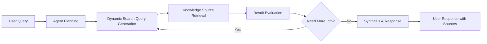

# Challenge 10 - Python - Build Agentic RAG with Azure AI Search

[< Previous Challenge](./Challenge-09-python.md) - **[Home](../README.md)**

[](Challenge-10-csharp.md)
[](Challenge-10-python.md)


## Introduction

In this challenge, you'll build an advanced **Agentic Retrieval-Augmented Generation (RAG)** system using Azure AI Search. Unlike traditional RAG approaches that simply retrieve and present information, agentic retrieval allows AI agents to intelligently decide what information to retrieve, when to retrieve it, and how to use it to answer complex questions.

You'll implement a conversational AI system that can dynamically search through knowledge bases, reason about the retrieved information, and provide comprehensive answers while showing you exactly how it found and processed the information.

## Concepts

Before diving into the implementation, let's understand the key concepts that make agentic retrieval powerful for modern AI applications.

### Agentic Retrieval vs Traditional RAG

**Traditional RAG:**

- Fixed retrieval patterns based on similarity search
- Limited reasoning about what information is needed
- Static chunk retrieval without context awareness
- Simple concatenation of retrieved content

**Agentic Retrieval:**

- **Dynamic Query Planning**: AI decides what information to search for
- **Iterative Refinement**: Can perform multiple searches to gather comprehensive information
- **Contextual Reasoning**: Understands when retrieved information is sufficient or needs refinement
- **Intelligent Synthesis**: Combines multiple sources with reasoning about relevance and accuracy

### Azure AI Search Knowledge Agents

Azure AI Search provides native support for agentic retrieval through:

- **Knowledge Sources**: Structured data repositories that agents can query
- **Knowledge Agents**: AI entities that can intelligently retrieve and reason about information
- **Retrieval Orchestration**: Automated coordination of search queries and result synthesis
- **Activity Tracking**: Detailed logs of how agents found and processed information

### Agentic Retrieval Workflow



### Enterprise Knowledge Integration

Agentic retrieval enables powerful enterprise scenarios:

- **Multi-Source Knowledge**: Query across documents, databases, and APIs
- **Contextual Understanding**: Understand business context and domain-specific needs
- **Audit Trails**: Track exactly how information was found and used
- **Source Attribution**: Provide clear references to original content
- **Security Integration**: Respect access controls and data governance policies

## Description
In this challenge, you'll complete a partially implemented agentic RAG system that demonstrates how AI agents can intelligently search through a knowledge base about "Earth at Night" using NASA data. The system showcases advanced retrieval capabilities where the agent decides what to search for and how to synthesize the results.

You'll work with a [starter project](./Resources/Challenge-10/AgenticRAG) included in this repository. The conversational interface is already implemented, but you need to complete the core agentic retrieval functionality using Azure AI Search.

### Task 1: Set up Azure Resources

Create and configure the required Azure services for agentic retrieval.

1. **Create Azure AI Search Service**:
   - Create a new Azure AI Search service in the Azure portal
   - Choose a Standard tier or higher to support vector search and semantic capabilities    

2. **Deploy required models**:
   - Chat completion model (e.g., gpt-4o)
   - Text embedding model (e.g., text-embedding-ada-002)

### Task 2: Configure Access and set up permissions

Before proceeding, you need to configure access permissions for agentic retrieval. Azure AI Search agentic retrieval requires specific permissions to work with Azure OpenAI services.

1. **Configure your identity and permissions**:
   - Ensure you're signed in to Azure CLI: `az login`
   - Check your current account: `az account show`

2. **Grant access to Azure AI Search for agentic retrieval**:
   - **For Azure AI Search**: 
        - Enable role-based access on Search service.
        - Create a system-assigned managed identity.
        - Assign `Search Service Contributor, Search Index Data Contributor and Search Index Data Reader` role to yourself
   - **For Azure OpenAI**: Assign `Cognitive Services OpenAI User` role to the managed identity of your search service.

### Task 3: Configure the Application

Navigate to the starter project and configure your Azure service settings.

1. **Open the starter project**:

```bash
cd Student/Resources/Challenge-10/AgenticRAG
```

2. **Update `appsettings.json`** with your Azure service configurations:

   ```json
   {
     "AzureOpenAI": {
       "Endpoint": "https://your-openai-service.openai.azure.com",
       "ApiKey": "your-openai-api-key",
       "DeploymentName": "gpt-4o",
       "Model": "gpt-4o",
       "EmbeddingsDeploymentName": "text-embedding-ada-002",
       "EmbeddingsModel": "text-embedding-ada-002"
     },
     "AzureAISearch": {
       "Endpoint": "https://your-search-service.search.windows.net",
       "SearchKey": "your-search-admin-key",
       "IndexName": "nasa-earth-night-index",
       "KnowledgeSourceName": "nasa-knowledge-source",
       "KnowledgeAgentName": "earth-night-agent"
     }
   }
   ```

### Task 3: Implement Agentic Retrieval Components

The four key components you need to implement are:

1. **Search Index Creation**: Define and create a search index with fields for document ID, content, embeddings, and page numbers. Configure semantic ranking and vector search using your Azure OpenAI embeddings deployment.

2. **Data Upload**: Load and upload the NASA "Earth at Night" dataset into your search index.

3. **Knowledge Source**: Create a knowledge source that references your search index, specifying which fields to use for retrieval.

4. **Knowledge Agent**: Set up a knowledge agent that connects your OpenAI deployment and knowledge source, enabling intelligent, agentic retrieval and synthesis of answers.

> **Reference Guide**: For detailed implementation steps and code examples, you can reference the [Azure AI Search agentic retrieval quickstart guide](https://learn.microsoft.com/en-us/azure/search/search-get-started-agentic-retrieval?tabs=search-perms%2Csearch-endpoint&pivots=programming-language-csharp) which provides comprehensive examples for each component.

#### 3.1 Create a search index.

Create a search index. The index schema contains fields for document identification and page content, embeddings, and numbers. The schema also includes configurations for semantic ranking and vector search, which uses your embeddings deployment to vectorize text and match documents based on semantic or conceptual similarity.

You can create the search index programmatically (as shown below), or by using the **Azure portal**. In the Azure portal, navigate to your Azure AI Search resource, select **Indexes**, and use the UI to define fields, semantic settings, and vector search configurations. This provides a visual way to set up your index if you prefer not to use code.

```csharp
// Define fields for the index
var fields = new List<SearchField>
{
    new SimpleField("id", SearchFieldDataType.String) { IsKey = true, IsFilterable = true, IsSortable = true, IsFacetable = true },
    new SearchField("page_chunk", SearchFieldDataType.String) { IsFilterable = false, IsSortable = false, IsFacetable = false },
    new SearchField("page_embedding_text_3_large", SearchFieldDataType.Collection(SearchFieldDataType.Single)) { VectorSearchDimensions = 3072, VectorSearchProfileName = "hnsw_text_3_large" },
    new SimpleField("page_number", SearchFieldDataType.Int32) { IsFilterable = true, IsSortable = true, IsFacetable = true }
};

// Define a vectorizer
var vectorizer = new AzureOpenAIVectorizer(vectorizerName: "azure_openai_text_3_large")
{
    Parameters = new AzureOpenAIVectorizerParameters
    {
        ResourceUri = new Uri(aoaiEndpoint),
        DeploymentName = aoaiEmbeddingDeployment,
        ModelName = aoaiEmbeddingModel
    }
};

// Define a vector search profile and algorithm
var vectorSearch = new VectorSearch()
{
    Profiles =
    {
        new VectorSearchProfile(
            name: "hnsw_text_3_large",
            algorithmConfigurationName: "alg"
        )
        {
            VectorizerName = "azure_openai_text_3_large"
        }
    },
    Algorithms =
    {
        new HnswAlgorithmConfiguration(name: "alg")
    },
    Vectorizers =
    {
        vectorizer
    }
};

// Define a semantic configuration
var semanticConfig = new SemanticConfiguration(
    name: "semantic_config",
    prioritizedFields: new SemanticPrioritizedFields
    {
        ContentFields = { new SemanticField("page_chunk") }
    }
);

var semanticSearch = new SemanticSearch()
{
    DefaultConfigurationName = "semantic_config",
    Configurations = { semanticConfig }
};

// Create the index
var index = new SearchIndex(indexName)
{
    Fields = fields,
    VectorSearch = vectorSearch,
    SemanticSearch = semanticSearch
};

// Create the index client, deleting and recreating the index if it exists
var indexClient = new SearchIndexClient(new Uri(searchEndpoint), credential);
await indexClient.CreateOrUpdateIndexAsync(index);
Console.WriteLine($"Index '{indexName}' created or updated successfully.");
```

#### 3.2 Upload Data to the Index

You can upload data to your Azure AI Search index in two main ways:

- **Using an Indexer via the Azure Portal (Pull Method):**  
    This is known as the "pull" method, where Azure AI Search automatically pulls data from supported data sources (such as Azure Blob Storage, SQL Database, or Cosmos DB) using an indexer. You can configure and schedule indexers in the Azure portal, making it ideal for ongoing or large-scale data ingestion scenarios. The portal provides a visual interface for mapping fields and managing indexing jobs.

- **Uploading Data Programmatically (Push Method):**  
    This is the "push" method, where you directly push data into the search index using code. For simplicity in this challenge, we'll upload a single file containing NASA "Earth at Night" data directly to the index programmatically. This approach is quick and effective for small datasets or initial prototyping.

```csharp
// Upload sample documents from the GitHub URL
string url = "https://raw.githubusercontent.com/Azure-Samples/azure-search-sample-data/refs/heads/main/nasa-e-book/earth-at-night-json/documents.json";
var httpClient = new HttpClient();
var response = await httpClient.GetAsync(url);
response.EnsureSuccessStatusCode();
var json = await response.Content.ReadAsStringAsync();
var documents = JsonSerializer.Deserialize<List<Dictionary<string, object>>>(json);
var searchClient = new SearchClient(new Uri(searchEndpoint), indexName, credential);
var searchIndexingBufferedSender = new SearchIndexingBufferedSender<Dictionary<string, object>>(
        searchClient,
        new SearchIndexingBufferedSenderOptions<Dictionary<string, object>>
        {
                KeyFieldAccessor = doc => doc["id"].ToString(),
        }
);
await searchIndexingBufferedSender.UploadDocumentsAsync(documents);
await searchIndexingBufferedSender.FlushAsync();
Console.WriteLine($"Documents uploaded to index '{indexName}' successfully.");
```

```csharp
// Upload sample documents from the GitHub URL
string url = "https://raw.githubusercontent.com/Azure-Samples/azure-search-sample-data/refs/heads/main/nasa-e-book/earth-at-night-json/documents.json";
var httpClient = new HttpClient();
var response = await httpClient.GetAsync(url);
response.EnsureSuccessStatusCode();
var json = await response.Content.ReadAsStringAsync();
var documents = JsonSerializer.Deserialize<List<Dictionary<string, object>>>(json);
var searchClient = new SearchClient(new Uri(searchEndpoint), indexName, credential);
var searchIndexingBufferedSender = new SearchIndexingBufferedSender<Dictionary<string, object>>(
    searchClient,
    new SearchIndexingBufferedSenderOptions<Dictionary<string, object>>
    {
        KeyFieldAccessor = doc => doc["id"].ToString(),
    }
);
await searchIndexingBufferedSender.UploadDocumentsAsync(documents);
await searchIndexingBufferedSender.FlushAsync();
Console.WriteLine($"Documents uploaded to index '{indexName}' successfully.");
```

#### 3.3 Create Knowledge Source

Configure a knowledge source that the agent can query.
A knowledge source is a reusable reference to your source data. The following code defines a knowledge source that targets your index.

```csharp
// Create a knowledge source
var indexKnowledgeSource = new SearchIndexKnowledgeSource(
    name: knowledgeSourceNames,
    searchIndexParameters: new SearchIndexKnowledgeSourceParameters(searchIndexName: indexName)
    {
        SourceDataSelect = "id,page_chunk,page_number"
    }
);
await indexClient.CreateOrUpdateKnowledgeSourceAsync(indexKnowledgeSource);
Console.WriteLine($"Knowledge source '{knowledgeSourceName}' created or updated successfully.");
```

#### 3.4 Create Knowledge Agent

Set up the intelligent agent that will perform agentic retrieval.

To target your knowledge source and your model deployment at query time, you need a knowledge agent. A knowledge agent connects your Azure OpenAI deployment with one or more knowledge sources, enabling advanced retrieval and synthesis capabilities.

> **Tip:** You can add multiple knowledge sources to a single knowledge agent. This allows the agent to retrieve and reason across different datasets, indexes, or repositories, making your retrieval system more flexible and powerful.

```csharp
// Create a knowledge agent
var openAiParameters = new AzureOpenAIVectorizerParameters
{
    ResourceUri = new Uri(aoaiEndpoint),
    DeploymentName = aoaiGptDeployment,
    ModelName = aoaiGptModel
};

var agentModel = new KnowledgeAgentAzureOpenAIModel(azureOpenAIParameters: openAiParameters);
var outputConfig = new KnowledgeAgentOutputConfiguration
{
    Modality = KnowledgeAgentOutputConfigurationModality.AnswerSynthesis,
    IncludeActivity = true
};

var agent = new KnowledgeAgent(
    name: knowledgeAgentName,
    models: new[] { agentModel },
    knowledgeSources: new KnowledgeSourceReference[] {
        new KnowledgeSourceReference(knowledgeSourceName) {
            IncludeReferences = true,
            IncludeReferenceSourceData = true,
            RerankerThreshold = (float?)2.5
        }
    }
)
{
    OutputConfiguration = outputConfig
};

await indexClient.CreateOrUpdateKnowledgeAgentAsync(agent);
Console.WriteLine($"Knowledge agent '{knowledgeAgentName}' created or updated successfully.");
```

**Hints for Implementation:**

- Use `SearchIndexClient` for index management operations
- Use `SearchClient` for data upload operations
- The knowledge source connects your data to the agent
- The knowledge agent needs both the OpenAI service and the knowledge source configuration

### Task 4: Run the Agentic Retrieval

You're ready to run agentic retrieval by sending a two-part user query to your knowledge agent. Given the conversation history and retrieval parameters, the agent will:

- Analyzes the entire conversation to infer the user's information need.
- Decomposes the compound query into focused subqueries.
- Runs the subqueries concurrently against your knowledge source.
- Uses semantic ranker to rerank and filter the results.
- Synthesizes the top results into a natural-language answer.

```csharp
// Use agentic retrieval to fetch results
var agentClient = new KnowledgeAgentRetrievalClient(
    endpoint: new Uri(searchEndpoint),
    agentName: knowledgeAgentName,
    tokenCredential: new DefaultAzureCredential()
);

messages.Add(new Dictionary<string, string>
{
    { "role", "user" },
    { "content", @"Why do suburban belts display larger December brightening than urban cores even though absolute light levels are higher downtown?
    Why is the Phoenix nighttime street grid is so sharply visible from space, whereas large stretches of the interstate between midwestern cities remain comparatively dim?" }
});

var retrievalResult = await agentClient.RetrieveAsync(
    retrievalRequest: new KnowledgeAgentRetrievalRequest(
        messages: messages
            .Where(message => message["role"] != "system")
            .Select(
                message => new KnowledgeAgentMessage(content: new[] { new KnowledgeAgentMessageTextContent(message["content"]) }) { Role = message["role"] }
            )
            .ToList()
    )
);

messages.Add(new Dictionary<string, string>
{
    { "role", "assistant" },
    { "content", (retrievalResult.Value.Response[0].Content[0] as KnowledgeAgentMessageTextContent).Text }
});
```

### Task 5: Test Agentic Retrieval

1. **Test with various question types**:
   - **Factual Questions**: "What is the Earth at night project about?"
   - **Analytical Questions**: "How does light pollution affect astronomical observations?"
   - **Comparative Questions**: "What are the differences between urban and rural nighttime lighting?"
   - **Complex Queries**: "Explain the relationship between economic development and nighttime lighting patterns"

2. **Observe the agentic behavior**:
   - Notice how the agent plans its retrieval strategy
   - Review the activity logs to see search decisions
   - Examine source references and how information is synthesized

### Task 6: Analyze Retrieval Intelligence

The application displays detailed information about how the agent processes your questions:

- **Response**: The final synthesized answer
- **Activity**: Step-by-step actions the agent took
- **Results**: Source documents and retrieval details

Pay attention to:

- How the agent reformulates your question for better retrieval
- When it decides it needs additional information
- How it synthesizes information from multiple sources
- The quality of source attribution

## Success Criteria

- ✅ **Azure Resources**: Successfully create and configure Azure AI Search and Azure OpenAI services
- ✅ **Application Configuration**: Properly configure connection strings and deployment settings
- ✅ **Index Creation**: Successfully create and populate the search index with NASA data
- ✅ **Knowledge Components**: Create functional knowledge source and knowledge agent
- ✅ **Agentic Retrieval**: Demonstrate intelligent query planning and information synthesis
- ✅ **Conversation Flow**: Engage in multi-turn conversations with context preservation
- ✅ **Activity Analysis**: Understand and explain the agent's retrieval decision process
- ✅ **Complex Queries**: Successfully handle questions requiring multi-step reasoning

## Learning Resources

- [Agentic Retrieval Concepts | Microsoft Learn](https://learn.microsoft.com/en-us/azure/search/search-agentic-retrieval-concept)
- [Get Started with Agentic Retrieval | Microsoft Learn](https://learn.microsoft.com/en-us/azure/search/search-get-started-agentic-retrieval?tabs=search-perms%2Csearch-endpoint&pivots=programming-language-csharp)
- [Azure AI Search .NET SDK | Microsoft Learn](https://learn.microsoft.com/en-us/dotnet/api/overview/azure/search.documents-readme)
- [RAG Patterns and Practices | Microsoft Learn](https://learn.microsoft.com/en-us/azure/architecture/ai-ml/guide/rag/rag-solution-design-and-evaluation-guide)
