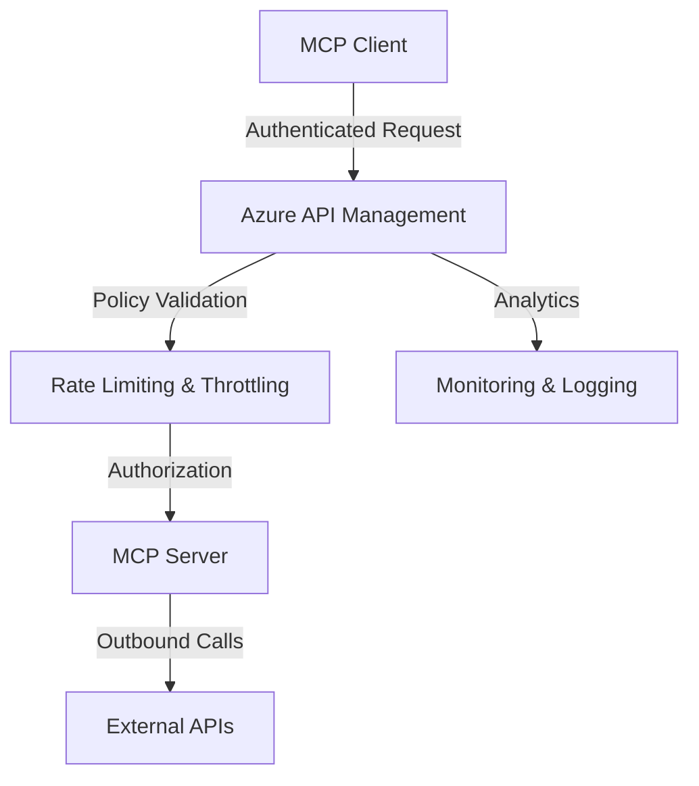

# Challenge 11 - Optional - Secure access to MCP servers in API Management

[< Previous Challenge](./Challenge-10-csharp.md) - **[Home](../README.md)** - [Next Challenge >](./Challenge-12.md)

## Introduction

In the previous challenges, you've built MCP servers and clients, implemented security with API keys, and deployed them remotely. While these implementations provide basic security, enterprise scenarios require more sophisticated security patterns including centralized authentication, authorization policies, rate limiting, and comprehensive monitoring. Azure API Management provides a powerful gateway layer that can secure, govern, and monitor access to your MCP servers at scale.

In this challenge, you'll learn how to use Azure API Management to secure access to MCP servers, implementing both **inbound security** (protecting your MCP server from unauthorized clients) and **outbound security** (securely calling external APIs from your MCP server tools). This enterprise-grade approach provides centralized security management, detailed analytics, and robust protection for your agentic AI applications.

## Concepts

### Model Context Protocol (MCP) Overview

The Model Context Protocol (MCP) is an open standard that connects AI models and agents with external data sources such as databases, APIs, and other services. It enables LLMs and AI agents to access external capabilities through a standardized protocol, solving the limitation of models being isolated from real-time or external data.

### MCP Server Types in API Management

Azure API Management supports exposing MCP servers in two primary ways:

#### 1. Existing MCP Server (Proxy Mode)
- Expose MCP-compatible servers hosted externally through API Management
- Add governance layer to existing MCP implementations
- Support for servers built with LangChain, LangServe, Azure Logic Apps, Azure Functions
- Centralize security, monitoring, and access control for distributed MCP servers

#### 2. REST API as MCP Server (will cover this in next challenges)
- Expose any REST API managed in API Management as an MCP server
- API operations automatically become MCP tools
- Transform existing RESTful endpoints into agent-compatible tools
- Leverage existing API investments for AI scenarios

### Azure API Management for MCP Servers

Azure API Management acts as a secure gateway between MCP clients and your MCP servers, providing:

- **Centralized Security**: Single point for authentication, authorization, and security policies
- **Traffic Management**: Rate limiting, throttling, and load balancing
- **Monitoring & Analytics**: Detailed insights into API usage and performance  
- **Policy Enforcement**: Apply consistent security and transformation policies
- **Developer Portal**: Self-service API discovery and documentation

### MCP Security Architecture



### Inbound vs Outbound Security

**Inbound Security** protects your MCP server from unauthorized access:

- Client authentication (subscription keys, OAuth tokens)
- Request validation and rate limiting
- IP filtering and CORS policies
- Request transformation and sanitization

**Outbound Security** secures calls made by your MCP server to external services:

- Credential management for backend APIs
- Token injection and rotation
- Secure storage of API keys and secrets
- Authentication to downstream services

### Authentication Methods

#### Subscription Key Authentication

- Simple, API Management-specific keys
- Passed in `Ocp-Apim-Subscription-Key` header
- Suitable for service-to-service scenarios
- Built-in rate limiting and analytics

#### OAuth 2.0 with Microsoft Entra ID

- Standards-based authentication
- Support for user and application identities
- Token validation and claims-based authorization
- Integration with enterprise identity systems

### API Management Policies

Policies are XML-based configurations that modify request/response behavior:

- **Inbound**: Applied before forwarding to backend MCP server
- **Backend**: Applied when communicating with backend MCP server
- **Outbound**: Applied before returning response to MCP client
- **On-Error**: Applied when errors occur during MCP tool execution

#### Common MCP Governance Patterns
- **Rate Limiting**: Prevent abuse with `rate-limit-by-key` policies based on client IP or user identity
- **Authentication**: Validate API keys, OAuth tokens, or subscription keys
- **IP Filtering**: Restrict access based on client IP addresses
- **Request Validation**: Ensure proper request format and size limits
- **Response Caching**: Cache tool responses to improve performance

> **Important**: Do not access the response body using `context.Response.Body` variable within MCP server policies, as this triggers response buffering which interferes with the streaming behavior required by MCP servers.

## Description

In this challenge, you will secure your MCP Weather Server using Azure API Management. You'll implement inbound authentication (protecting access to your MCP server) and explore how API Management provides enterprise-grade security and monitoring capabilities. This builds upon your previous work while adding centralized security management.

### Task 1: Create and Configure Azure API Management Instance

Set up Azure API Management to act as a secure gateway for your MCP server.

If you don't already have an API Management instance, complete the following quickstart: [Create an Azure API Management instance](https://learn.microsoft.com/en-us/azure/api-management/get-started-create-service-instance)

### Task 2: Expose an Existing MCP Server

Learn how to expose and govern an existing MCP server through API Management. This approach is useful when you have MCP servers hosted in Azure Functions, Logic Apps, LangServe, or other platforms.

1. **Prepare Your Existing MCP Server**:
   - Verify it supports Streamable HTTP transport
   - Note the base URL of your existing MCP server
   - Gather authentication credentials (API keys, OAuth tokens, etc.)

2. **Create MCP Server in API Management**:
   - In the Azure portal, navigate to your API Management instance
   - Go to **APIs** → **MCP servers** → **+ Create MCP server**
   - Select **Expose an existing MCP server**
   - Configure the backend MCP server:
     - **Base URL**: Enter your existing MCP server URL (e.g., `https://your-function-app.azurewebsites.net/api/mcp`)
     - **Transport type**: Select **Streamable HTTP** (default)
   - Configure the new MCP server in API Management:
     - **Name**: Enter a descriptive name (e.g., "Weather Tools MCP Server")
     - **Base path**: Enter a route prefix for tools (e.g., `weather-tools`)
     - **Description**: Optional description for documentation
   - Click **Create**

3. **Verify MCP Server Creation**:
   - The MCP server should appear in the **MCP Servers** list
   - Note the **Server URL** which will be used by MCP clients
   - Format: `https://<your-apim-name>.azure-api.net/<base-path>/mcp`

### Task 3: Configure MCP Server Governance Policies

Apply comprehensive governance policies specifically designed for MCP servers.

1. **Create MCP-Optimized Policy**:
   Navigate to your MCP server's **Policies** section and add:
   
   ```xml
   <policies>
       <inbound>
           <base />
           <!-- Validate subscription key -->
           <check-header name="Ocp-Apim-Subscription-Key" failed-check-httpcode="401" failed-check-error-message="Subscription key required" ignore-case="true" />           
           
           <!-- Forward subscription key to backend if needed -->
           <set-header name="X-API-Key" exists-action="override">
               <value>@(context.Request.Headers.GetValueOrDefault("Ocp-Apim-Subscription-Key"))</value>
           </set-header>
       </inbound>
   </policies>
   ```

2. **Optional: Implement OAuth 2.0 with Entra ID**:
   For enterprise scenarios, replace subscription key with OAuth:
   ```xml
   <policies>
       <inbound>
           <validate-azure-ad-token tenant-id="your-entra-tenant-id" 
                                   header-name="Authorization" 
                                   failed-validation-httpcode="401" 
                                   failed-validation-error-message="Unauthorized. Access token is missing or invalid.">
               <client-application-ids>
                   <application-id>your-client-application-id</application-id>
               </client-application-ids>
           </validate-azure-ad-token>
           
           <!-- Forward token to backend -->
           <set-header name="Authorization" exists-action="override">
               <value>@(context.Request.Headers.GetValueOrDefault("Authorization"))</value>
           </set-header>
       </inbound>
   </policies>
   ```

### Task 4: Update MCP Client Configuration

Configure your MCP client to work with the secured API Management gateway.

1. **Update MCP Client for Subscription Key Authentication**:
   ```csharp
   var clientTransport = new SseClientTransport(new SseClientTransportOptions()
   {
       Endpoint = new Uri("https://<your-apim-name>.azure-api.net/weather-mcp/sse"),
       AdditionalHeaders = new Dictionary<string, string>
       {
           { "Ocp-Apim-Subscription-Key", "<your-subscription-key>" }
       }
   });
   ```

2. **For OAuth 2.0 Authentication** (if implemented):
   
   ```csharp
   // Acquire token from Entra ID
   var app = ConfidentialClientApplicationBuilder
       .Create(clientId)
       .WithClientSecret(clientSecret)
       .WithAuthority(new Uri($"https://login.microsoftonline.com/{tenantId}"))
       .Build();
   
   var result = await app.AcquireTokenForClient(new[] { scope }).ExecuteAsync();
   
   var clientTransport = new SseClientTransport(new SseClientTransportOptions()
   {
       Endpoint = new Uri("https://<your-apim-name>.azure-api.net/weather-mcp/sse"),
       AdditionalHeaders = new Dictionary<string, string>
       {
           { "Authorization", $"Bearer {result.AccessToken}" }
       }
   });
   ```

3. **Visual Studio Code MCP Configuration**:
   Update your VS Code settings to use the secured endpoint with proper authentication:
   
   ```json
   {
     "mcp": {
       "servers": {
         "weather-secure": {
           "name": "Secure Weather MCP Server",
           "type": "remote",
           "url": "https://<your-apim-name>.azure-api.net/weather-mcp",
           "transport": "streamable-http",
           "headers": {
             "Ocp-Apim-Subscription-Key": "<your-subscription-key>"
           }
         }
       }
     }
   }
   ```

### Task 5: Test Security and Monitor Usage

Verify your security implementation and explore monitoring capabilities.

1. **Test Authentication**:
   - Try accessing the MCP server without authentication (should fail)
   - Verify successful access with valid credentials
   - Test rate limiting by exceeding configured limits

2. **Monitor API Usage**:
   - Navigate to **Analytics** in API Management
   - Review request volumes, response times, and error rates
   - Examine security events and blocked requests


## Success Criteria

- ✅ Azure API Management instance is deployed and accessible
- ✅ MCP Weather Server is imported and secured with API Management policies
- ✅ Subscription key authentication is implemented and working
- ✅ MCP client successfully authenticates and communicates through API Management
- ✅ Security monitoring and analytics are enabled and functional
- ✅ Unauthorized access attempts are properly blocked and logged
- ✅ Optional: OAuth 2.0 authentication with Entra ID is implemented

## Learning Resources

- [Secure access to MCP servers in API Management](https://learn.microsoft.com/en-us/azure/api-management/secure-mcp-servers)
- [Expose and govern an existing MCP server](https://learn.microsoft.com/en-us/azure/api-management/expose-existing-mcp-server)
- [Quickstart: Create a new Azure API Management instance by using the Azure portal](https://learn.microsoft.com/en-us/azure/api-management/get-started-create-service-instance)
- [About MCP servers in Azure API Management](https://learn.microsoft.com/en-us/azure/api-management/mcp-server-overview)
- [API Management Policies Reference](https://docs.microsoft.com/en-us/azure/api-management/api-management-policies)
- [API Management Security Features](https://docs.microsoft.com/en-us/azure/api-management/api-management-security-controls)
- [Credential Manager in API Management](https://learn.microsoft.com/en-us/azure/api-management/credentials-overview)
- [Remote MCP Server Samples with API Management](https://github.com/Azure-Samples/remote-mcp-apim-functions-python)
- [MCP Client Authorization Lab](https://github.com/Azure-Samples/AI-Gateway/tree/main/labs/mcp-client-authorization)

