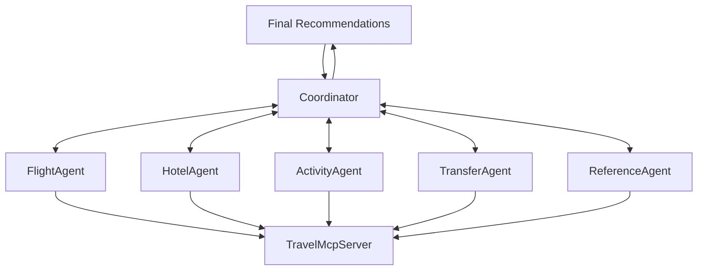
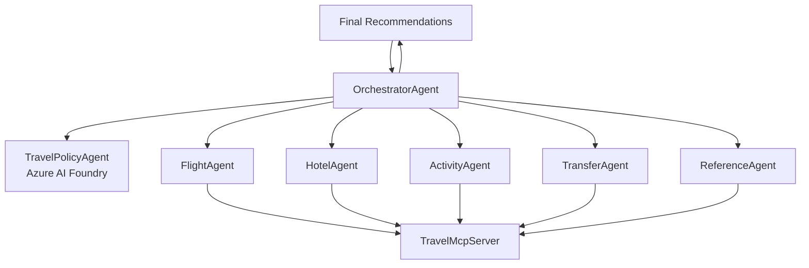

# Travel Multi-Agent Client

A Microsoft Agent Framework (MAF)-based multi-agent orchestrator acting as a comprehensive Travel Agent Assistant.

## Overview

This project implements a sophisticated travel planning system using the Microsoft Agent Framework (MAF) with multiple orchestration patterns. It coordinates multiple specialized agents to provide comprehensive travel assistance, from flight booking to activity recommendations, with support for sequential, parallel, handoff, and "agents-as-tools" workflow patterns.

## Architecture

### Multi-Agent System

The system consists of 7 specialized agents that work together using various orchestration patterns:

#### 🎯 CoordinatorAgent
- **Role**: Workflow coordinator and customer interface
- **Responsibilities**: 
  - Primary customer interaction in workflow patterns
  - Request analysis and delegation
  - Travel plan synthesis
  - Budget estimation
  - Coordinates with specialized agents via handoffs
  - Final recommendations

#### 🎭 OrchestratorAgent
- **Role**: Main orchestrator using agents-as-tools pattern
- **Responsibilities**: 
  - Primary customer interface when using agents-as-tools pattern
  - Direct delegation to specialized agents as function tools
  - Synthesizes responses from multiple agents
  - Intelligent routing of customer requests
  - Creates comprehensive travel solutions

#### 📋 TravelPolicyAgent
- **Role**: Travel policy and compliance specialist
- **Responsibilities**: 
  - Connects to Azure AI Foundry Agent Service
  - Validates bookings against travel policies
  - Checks compliance and restrictions
  - Provides policy guidance before finalizing bookings
  - Integration with Persistent Agents Client

#### ✈️ FlightAgent
- **Role**: Flight search and booking specialist
- **Capabilities**:
  - Real-time flight searches
  - Price comparison across airlines
  - Route optimization
  - Travel class recommendations

#### 🏨 HotelAgent
- **Role**: Accommodation specialist
- **Capabilities**:
  - Hotel searches by city/location
  - Amenity filtering
  - Rating analysis
  - Value recommendations

#### 🎭 ActivityAgent
- **Role**: Tours and experiences specialist
- **Capabilities**:
  - Local activity discovery
  - Cultural experience recommendations
  - Point of interest searches
  - Interest-based filtering

#### 🚗 TransferAgent
- **Role**: Ground transportation specialist
- **Capabilities**:
  - Airport transfers
  - City transportation
  - Vehicle category selection
  - Hourly rentals

#### 📊 ReferenceAgent
- **Role**: Travel data and reference specialist
- **Capabilities**:
  - Airport/city code lookup
  - Location searches
  - Travel insights
  - Route information

## Features

### 🌟 Core Capabilities
- **Multiple Orchestration Patterns**: Sequential, Parallel, Handoff, and Agents-as-Tools workflows
- **Natural Language Processing**: Understands complex travel requests
- **Multi-Agent Coordination**: Specialized agents work together seamlessly
- **Real-Time Data**: Connects to TravelMcpServer for live travel information via MCP protocol
- **Comprehensive Planning**: Handles flights, hotels, activities, and transfers
- **Budget Estimation**: Provides realistic cost projections
- **Interactive Chat**: Conversational interface for easy interaction
- **Policy Compliance**: Integrates with Azure AI Foundry Agent Service for travel policy validation

### � Workflow Patterns

#### 1. Sequential Workflow
Agents execute in a predefined order:
```
Coordinator → Flight → Hotel → Activity → Transfer → Reference
```

#### 2. Parallel (Concurrent) Workflow
All agents execute simultaneously for faster response:
```
Coordinator, Flight, Hotel, Activity, Transfer, Reference (parallel execution)
```

#### 3. Handoff Workflow
Dynamic agent handoffs based on conversation context:
```
Coordinator ⇄ Flight
Coordinator ⇄ Hotel
Coordinator ⇄ Activity
Coordinator ⇄ Transfer
Coordinator ⇄ Reference
```

#### 4. Agents-as-Tools Pattern
Main orchestrator uses other agents as function tools:
```
OrchestratorAgent
  ├─ TravelPolicyAgent (Azure AI Foundry)
  ├─ FlightAgent
  ├─ HotelAgent
  ├─ ActivityAgent
  ├─ TransferAgent
  └─ ReferenceAgent
```

### 🛠️ Technical Features
- **Microsoft Agent Framework (MAF)**: Built on the latest agent orchestration framework
- **Azure OpenAI Integration**: Compatible with Azure OpenAI services
- **Model Context Protocol (MCP)**: Direct integration with MCP servers for tool access
- **OpenTelemetry Observability**: Comprehensive tracing, logging, and monitoring
- **Azure Application Insights**: Production-ready telemetry and diagnostics
- **Persistent Agents Client**: Integration with Azure AI Foundry Agent Service
- **Modular Architecture**: Easy to extend with new agents
- **Robust Error Handling**: Graceful failure management
- **Structured Logging**: OpenTelemetry-based logging with OTLP export

## Prerequisites

- .NET 8.0 SDK
- TravelMcpServer running
- Azure OpenAI service with API key and endpoint
- Azure AI Foundry Agent Service (for TravelPolicyAgent)
- Visual Studio 2022 or VS Code
- (Optional) Azure Application Insights for observability
- (Optional) Aspire Dashboard or OTLP-compatible endpoint for telemetry

## Configuration

### 1. API Keys and Service Setup

Configure your services in `appsettings.json` or user secrets:

```json
{
  "AzureOpenAI": {
    "ModelId": "gpt-4o",
    "ApiKey": "your-azure-openai-api-key",
    "Endpoint": "https://your-resource.openai.azure.com/"
  },
  "FoundryAgentService": {
    "Endpoint": "https://your-foundry-endpoint.azure.com",
    "AgentId": "your-agent-id"
  },
  "TravelMcpServer": {
    "BaseUrl": "http://localhost:3000"
  },
  "Observability": {
    "AspireUrl": "http://localhost:4317/v1/traces",
    "AppInsightsConnectionString": "InstrumentationKey=your-key;..."
  }
}
```

### 2. Azure AI Foundry Agent Setup

The TravelPolicyAgent connects to Azure AI Foundry Agent Service using `DefaultAzureCredential`:
- For local development, use `az login` with Azure CLI
- For production, configure managed identity or service principal
- Ensure proper RBAC permissions on the Foundry Agent Service

### 3. TravelMcpServer Configuration

Ensure the TravelMcpServer is running and accessible at the configured BaseUrl.

## Getting Started

### 1. Start TravelMcpServer

```bash
cd ../TravelMCPServer
dotnet run
```

### 2. Run the Multi-Agent Client

```bash
cd MAF.TravelMultiAgentClient
dotnet run
```

### 3. Choose Your Workflow Pattern

In `Program.cs`, uncomment the desired workflow pattern:

```csharp
// Option 1: Agents-as-Tools (Main Orchestrator)
await StartInteractiveChat(orchestratorAgent.Agent);

// Option 2: Sequential Workflow
// await StartInteractiveChat(sequentialWorkflow);

// Option 3: Parallel Workflow
// await StartInteractiveChat(concurrentWorkflow);

// Option 4: Handoff Workflow
// await StartInteractiveChat(handOffWorkflow);
```

### 4. Interact with the Travel Assistant

Example conversations:

```
You: I need to book a business trip to Paris from New York departing March 15th
```

```
You: Find me flights from NYC to London with hotels near the financial district for a 3-day conference
```

```
You: What's the budget estimate for a week-long business trip to Tokyo?
```

## Example Use Cases

### 🌍 Complete Business Trip Planning
- "I need a business trip to Tokyo with meetings downtown and hotel near the conference center"
- "Plan a 5-day business trip to London with client meetings in Canary Wharf"
- "Book travel to Singapore for an executive meeting next month"

### ✈️ Flight-Specific Requests
- "Find direct flights from LAX to CDG next Friday for a business meeting"
- "Compare business class options to Dubai for corporate travel"
- "Flexible date flights to Frankfurt for a week-long conference"

### 🏨 Accommodation Needs
- "Hotels near the convention center in Chicago under $250/night"
- "Business hotels in downtown San Francisco with meeting facilities"
- "Corporate-rate hotels near Heathrow Airport"

### 🚗 Ground Transportation
- "Airport transfer from JFK to Manhattan office"
- "Car service for client meetings in Los Angeles"
- "Executive transportation for Dubai business district"

## Agent Communication Flow

The system supports multiple communication patterns:

### Handoff Pattern Flow


### Agents-as-Tools Pattern Flow


## Project Structure

```
MAF.TravelMultiAgentClient/
├── Agents/
│   ├── CoordinatorAgent.cs         # Workflow coordinator agent
│   ├── OrchestratorAgent.cs        # Main orchestrator (agents-as-tools pattern)
│   ├── TravelPolicyAgent.cs        # Azure AI Foundry policy agent
│   ├── FlightAgent.cs              # Flight specialist
│   ├── HotelAgent.cs               # Hotel specialist
│   ├── ActivityAgent.cs            # Activity specialist
│   ├── TransferAgent.cs            # Transfer specialist
│   └── ReferenceAgent.cs           # Reference data specialist
├── Services/
│   ├── McpClientService.cs         # MCP server communication
│   ├── ConfigurationService.cs     # Configuration management
│   └── TelemetryService.cs         # OpenTelemetry setup
├── Program.cs                      # Main application & workflow setup
├── appsettings.json                # Configuration
├── appsettings.Development.json    # Development configuration
└── README.md                       # This file
```

## Dependencies

- **Microsoft.Agents.AI** (1.0.0-preview) - Microsoft Agent Framework core
- **Microsoft.Agents.AI.Workflows** (1.0.0-preview) - Workflow orchestration
- **Microsoft.Agents.AI.Workflows.Declarative** (1.0.0-preview) - Declarative workflows
- **Microsoft.SemanticKernel** (1.65.0) - Semantic Kernel integration
- **Microsoft.SemanticKernel.Agents.Core** (1.26.0-alpha) - Agent capabilities
- **ModelContextProtocol** (0.3.0-preview.4) - MCP client integration
- **Azure.AI.Agents.Persistent** - Azure AI Foundry Agent Service integration
- **OpenTelemetry** (1.13.0) - Observability framework
- **OpenTelemetry.Exporter.OpenTelemetryProtocol** (1.13.0) - OTLP export
- **OpenTelemetry.Instrumentation.Http** (1.12.0) - HTTP instrumentation
- **Azure.Monitor.OpenTelemetry.Exporter** (1.4.0) - Application Insights export
- **Microsoft.Extensions.*** (9.0.10) - .NET hosting, configuration, and DI
- **System.Text.Json** (9.0.10) - JSON serialization

## Development Notes

### Adding New Agents

1. Create a new agent class using `IChatClient.CreateAIAgent()`
2. Add MCP tools from `McpClientService` if needed
3. Configure the agent with appropriate name, description, and instructions
4. Register the agent in `Program.cs` dependency injection
5. Add the agent to the desired workflow pattern(s)

### Extending Functionality

- Add new MCP server endpoints by updating the MCP server
- MCP tools are automatically discovered and loaded via `McpClientService`
- Create new workflow patterns using `AgentWorkflowBuilder`
- Enable OpenTelemetry for new agents using `.AsBuilder().UseOpenTelemetry()`

### Observability

The application includes comprehensive observability:

- **OpenTelemetry Tracing**: Captures all agent interactions, HTTP calls, and workflows
- **Azure Application Insights**: Production-ready telemetry and diagnostics
- **Aspire Dashboard**: Local development observability (optional)
- **Structured Logging**: OpenTelemetry-based logging with OTLP export
- **HTTP Instrumentation**: Detailed capture of all HTTP requests/responses including query parameters, headers, and bodies

Enable sensitive data logging in `TelemetryService` for debugging (not recommended for production).

## Troubleshooting

### Common Issues

1. **MCP Server Connection**: Ensure TravelMcpServer is running on the configured port
2. **API Key Issues**: Verify Azure OpenAI configuration in appsettings.json
3. **Azure Authentication**: Use `az login` for local development with Foundry Agent Service
4. **Workflow Timeout**: Adjust connection timeout in `McpClientService` (currently 5 minutes)
5. **Missing MCP Tools**: Check that TravelMcpServer is properly exposing tools

### Logging

The application provides detailed logging. Check console output for:

- Agent initialization status
- MCP server communication and tool discovery
- Workflow execution and agent transitions
- OpenTelemetry trace and span information
- Error details and stack traces

## Future Enhancements

- 🔐 **Authentication & Authorization**: User account management
- 💾 **State Persistence**: Save and resume conversations across sessions
- 📱 **Web Interface**: Browser-based chat interface with workflow selection
- 🌐 **Multi-Language**: International language support
- 📈 **Analytics**: Usage patterns and performance metrics
- 🔄 **Booking Integration**: Complete end-to-end booking with payment
- 🎯 **Personalization**: User preference learning and profile management
- 🔌 **Additional MCP Servers**: Integration with more specialized travel services
- 📊 **Workflow Visualization**: Real-time visualization of agent interactions
- 🧪 **A/B Testing**: Compare different workflow patterns for optimization

